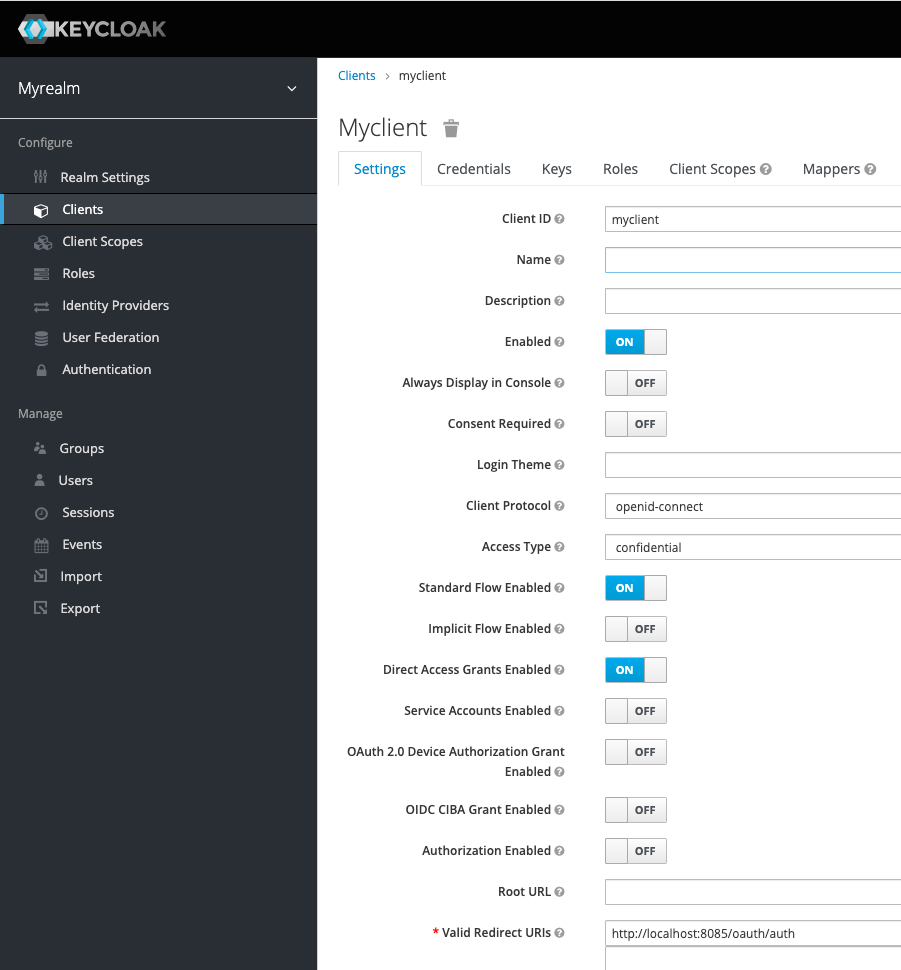

== Testing the OAuth2

We test the OAuth2 with several different vendors, but running it up and being able to make it
work for a repeatable test is provided by this set of instructions.

It is recommended you `chmod u+x *.sh` the scripts in this folder.

=== Running KeyCloak

We are going to run KeyCloak as it is an OAuth2 provider, and we have saved a database that is
all set up for basic authentication.

To run Keycloak, so it is already setup and ready to go for a KeyCloak test
for OAuth2, you can use the `./keycloak.sh` script. 

The default user is `myuser@mailinator.com` and the password is `password123`

The default admin is on http://localhost:8900/auth/admin with username and password `admin`

If you are using the *KeyCloak* oauth2 provider, your provider should look like this:

[source,properties]
----
oauth2.adminUiUrlSuccess=http://localhost:8085/#
oauth2.adminUiUrlFailure=http://localhost:8085/#oauth2-failure
oauth2.providers=oauth2-keycloak
oauth2.redirectUrl=http://localhost:8085/oauth/auth
# this is the correct secret for this instance of keycloak
oauth2.providers.keycloak.secret=cf58f851-ae24-4fad-a017-8f08118b46fc
# the script runs docker on this port
oauth2.providers.keycloak.url=http://localhost:8900
oauth2.providers.keycloak.realm=myrealm
oauth2.providers.keycloak.id=myclient
----

If you are using the *Generic* oauth2 provider, your provider gets more complicated because
you need to serve an icon that is allowed access via CORS (as it will be hosted on a different URL
to FeatureHub itself). So you will need to also run the nginx container, and it runs up locally
on port 8097.

should look like this:

[source,properties]
----
oauth2.adminUiUrlSuccess=http://localhost:8085/#
oauth2.adminUiUrlFailure=http://localhost:8085/#oauth2-failure
oauth2.providers=oauth2-generic
oauth2.providers.generic.secret=cf58f851-ae24-4fad-a017-8f08118b46fc
oauth2.providers.generic.auth-url=http://localhost:8900/auth/realms/myrealm/protocol/openid-connect/auth
oauth2.providers.generic.id=myclient
oauth2.providers.generic.token-url=http://localhost:8900/auth/realms/myrealm/protocol/openid-connect/token
oauth2.providers.generic.icon.url=http://localhost:8097/tech-leaders.png
oauth2.providers.generic.icon.background-color=0xCAE8DC
oauth2.providers.generic.icon.text=Sign in with Tech Leaders
----

=== Are you running on a different host?

You will need to add or change your allowed redirect URIs if yours isn't working. Go to the admin URL
listed above and away you go.

