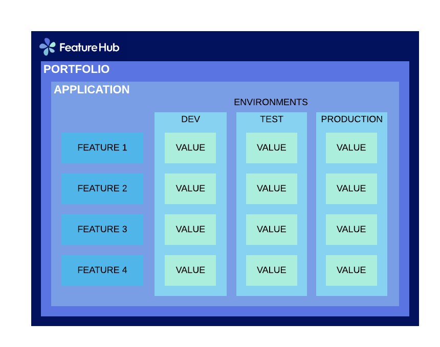

# FeatureHub documentation
                                                                                                                                                                                                                                                                                                                                                                                                                                                                        
## Overview
FeatureHub is a platform to help software teams manage and their features, from feature flags (also known as feature toggles) to A/B experiments and remote or centralised configuration management.

FeatureHub can be used with small startups through to large enterprises with many applications and teams.  It's has an enterprise grade security and permission model that is intuitive and easy to use.

## Key concepts

### Portfolios
Portfolios are simply a collection of applications.
  
#### Portfolio groups
You can create one or more groups of people, these groups can be used to set various permissions 
on the applications within the portfolio. Some example groups might be:
- Developers
- Testers
- Operations

#### Applications
Applications are where you create features.

#### Features
Features are the main part of FeatureHub, they can be simple feature flags or more advanced JSON formats.

##### Feature types
You can create features of the following types:
 - `Boolean` used for basic feature flags
 - `Number` numerical values
 - `String` string values 
 - `JSON` valid JSON only (typically used for remote configuration)
 - `YAML` valid YAML only (typically used for remote configuration)
 
##### Feature key
The feature key is the reference you use in your application, 
when you use the SDK you check the value of a feature referencing the feature key.  
It must be unique for your application.

#### Environments 
Applications have one or more environments.  When an application is created there is always an initial
environment called `Production` created.  The values of your features are set, per environment.  

Every FeatureHub environment has a unique ID, this ID is what you reference in your application via the SDK 
when you query for the value of a feature you must use this environment ID.
