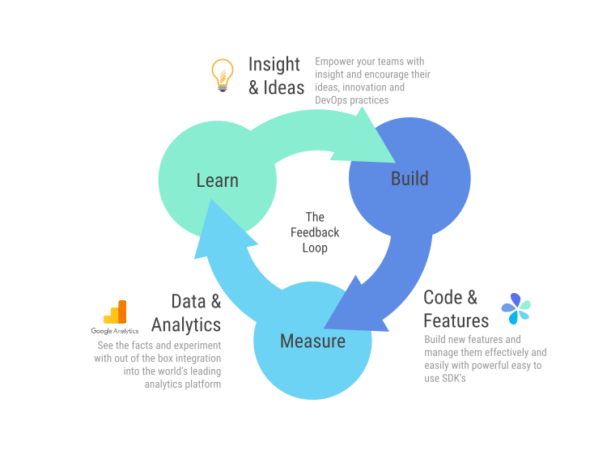

= FeatureHub Documentation 
ifdef::env-github,env-browser[:outfilesuffix: .adoc]
:sectlinks:
:toc: left
:toclevels: 2
:toc-title: Contents

FeatureHub Team <info@featurehub.io>

Visit us on https://github.com/featurehub-io/featurehub[Github]

== Overview

FeatureHub is a Cloud Native platform to help software teams manage their features, from feature flags (also known as feature toggles) to A/B experiments and remote or centralised configuration.
It's an essential ingredient for enabling the feedback loop and feature testing and experimentation in production with real users (see diagram below).

Building software with feature management encourages DevOps practices like
https://trunkbaseddevelopment.com[trunk based development], continuous delivery and importantly, separating deployment from release management.
Enabling teams to deliver value to customers early and often, whilst maintaining high quality and keeping risk low.

FeatureHub can be used with small startups through to large enterprises with many applications and teams.
It has an enterprise grade security and permission model, that's intuitive and easy to use, so you can be up and running quickly.

FeatureHub is a self-hosted platform so you can run it on your own infrastructure.

== Architecture

Please read link:architecture{outfilesuffix}[for information about the architecture of FeatureHub].

== Installation

There are 3 main deployment options for running FeatureHub. As FeatureHub is packaged as a _Cloud Native_
bundle, all parts are Docker images and are intended to be used with that technology (i.e. Docker or Kubernetes).

All sample configurations are in the `run-configurations` folder. All of the run configurations mount the
database volume separately from the main set of containers, allowing you to upgrade your database and
versions of FeatureHub without destroying your database.

NOTE: FeatureHub runs on the following SQL Databases: PostgreSQL, MySQL, MS SQL Server, Oracle and we provide
initialization and migration DDL for each of these databases. Others can be supported, please contact us.

=== Starting small

If you wish to get up and running without using `docker-compose` and downloading this repository, we would
recommend running this simple line:

----
docker run -p 8085:8085 -v ~/tmp:/db featurehub/party-server:0.0.4
----

where `~/tmp` is where you wish to store the database. This will start FeatureHub on port 8085 and you can now
create your first Superuser, Portfolio, Application, Feature etc.

Once you have done this, you can then simply run the example project and tie the two together.

=== Running the example

The example will need to know the SDK URL of your environment, and it will need an IP address that the second
docker can get access to. If you know how to use docker networks, you should be able to find this easily, otherwise
find your en0 ip address (you can type: `ifconfig en0` - choose the inet address, Windows will be slightly different)
or similar, do not use localhost as that will not work.

----
export SDK_URL=default/d8ba747d-7d3c-4454-9c58-130390848412/5EE3vua1NqY0ez6Zd4TXU7XnsZdAPHtR96XaDmhfegitKGiQ9aCdmtmeNUNPubkRZLJLUUpaC7b05ELk
export MY_IP=192.168.XX.XX
docker run -e FEATUREHUB_APP_ENV_URL=http://$MY_IP:8085/features/$SDK_URL -p 5000:5000  featurehub/example_node:0.0.1
----

This will cause the example to start and you can access it on port 5000. Add a few todo's in mixed case.
If you create a feature flag called `FEATURE_TITLE_TO_UPPERCASE`, unlock it and set it to true, you will see a "refresh"
message appear. If you refresh, it will upper case everything, experiment. This flag is affecting the backend.

If you create a feature value - a String value called `SUBMIT_COLOR_BUTTON` and set its value to (say) `cyan`, you will again see a refresh indicator and on refresh the Add button will swap to Cyan.
Each time you change the colour, it will recommend you refresh.
It is doing this because it is set in "catch and release" mode, and we recommend you read up on the SDKs for further information on this.

=== Further installation details

Further information on link:installation{outfilesuffix}[installation, deployment options, configuration, etc].

[#sdks]
== Client SDKs for Feature Hub

The client SDKs for FeatureHub are designed to allow various supported languages to connect to the Edge server and receive updates on the features.
Each different SDK is designed to be idiomatic to that language, but also each different SDK is expected to be used for a different purpose, and so capability varies.

This overview seeks to indicate the capabilities of the SDKs and explain what they are and do.
If you are considering helping us by writing a new SDK for your favourite language, or expand on an existing library, this table of capability indicates what each different language can support and where extra work is helpful.

=== Capabilities overview

[options="header"]
|===================================
|Capability|Java|Javascript^1^|Go|Dart
|Event Streaming|Y|Y|Y|Y
|Background Start|Y|Y|Y|Y
|Block until Start|N|N|Y|N
|Readyness Listeners|Y|Y|Y|Y
|Feature Listeners|Y|Y|Y|Y
|Feature Listener Removal|N|N|Y|Y
|Catch & Release|N|Y|N|Y
|Analytics Support|Y|Y|N|Y
|Google Analytics|Y|Y|N|N
|Test Client|Y|N|N|Y
|===================================

(1) Javascript and Typescript are supported via a Typescript library.

=== Capabilities explained

==== Event Streaming

This relates to the primary purpose of the FeatureHub platform, which is a platform by which a client is able to connect and then receive a constant stream of real-time updates to the features as they change.
This mechanism is supported via Server Side Events.

==== Background Start

This relates to the ability for the application to connect to a FeatureHub Edge server in the background and complete the initial transactions and continue listening for updates - all in the background.

==== Block until Start

This is usually a capability provided instead of readyness listeners, whereby the library can be told to wait until the connection has been successfully established and there is a list of features, or the connection fails for some reason.
It is used to ensure a client has a consistent set of features before functioning and is generally best used for server side software.

==== Readyness Listeners

These perform a similar function to Block until Start, but instead a server can call back or query the readyness status directly and perform the blocking function themselves.
The ToDo Java and Typescript examples use this mechanism.

==== Feature Listeners

This allows client code to listen for changes in the state of a feature, and to trigger some action based on the new state.
Generally the whole feature is passed to the listener for it to interrogate.

==== Feature Listener Removal

Some clients like to, or need to (usually UI related) remove listeners they have created.
This allows them to do that.

==== Catch & Release

Some clients don't want the features to be immediately triggered.
These are usually those that use Feature Listeners and they want to hold onto the changes until they have informed the user there are changes - via some UI element (e.g. reload for new functionality).
Catch and release mode normally includes a flag to set it, an extra callback to indicate new features have come in, and then a release method to indicate the new features should be released (their state changed and the listeners triggered).
The Typescript, Javascript and Dart libraries all have examples of this.

==== Analytics Support

This is where the library has a mechanism to log an event, potentially attach metadata.
The library captures the state of all of the features at the point in time of the request and will pass it on to any registered Analytics provider.
A platform can have analytics support but no analytics providers.
We intend over time to support only one, where the data is posted to a backend service which you can then decide where to send and how to send the data.

==== Google Analytics

This is a client side implementation of the Analytics support.
It is designed so you need to specify the `User-ID` or `CID`, your `UA-` id and when logging an event, it will fire off into GA the event - one for each value of non-JSON features.

==== Test Client / Feature Updater

This is designed to allow tests to change the values of features in their environments while they are running.
For integration or e2e tests that run sequentially in an environment it is a useful feature, but for load balanced tests running a variety of feature profiles all against the same environment, it is better to use OpenTracing or OpenTelemetry.
We will support this directly in the future.

This will depend on the permissions granted to the service account in the environment that is configured.
If the service account only has READ access, no changes will be allowed.
A typical service account would need UNLOCK and CHANGE_VALUE. Alternatively if features are always unlocked in test environments (which is usual), CHANGE_VALUE is all that is required, and READ is implicit.

Changes are checked against the latest version of the feature in the cache.
Changes that match the current state are simply ignored (and a 200 response given).
Changes generally take a second or two to propagate.

For other cases, the `FeatureStateUpdate` class has three fields.

- `lock` - if passed it will change the state of the lock.
You need LOCK permission to lock, UNLOCK permission to unlock.
If a feature is locked, any attempt to change it will be ignored.
- `value` - this is an "object" because it represents all types of values supported.
It can be null.
If it is null, and you want to ensure this is set to null (which is ignored for feature flags), make sure you set `updateValue`.
- `updateValue` - this is specifically for the situation where you are setting a non feature flag to have a null value.
Otherwise passing a value will assume this is true.

=== SDK Usage 

Choose from your development language / framework and follow the links for the implementation details and examples:

|===================================
|Language / framework| link:../sdks/client-java-jersey/README.adoc[Java-Jersey]|link:../sdks/client-typescript-core/README.adoc[Javascript, Typescript, Node, React, Angular]|Go - Coming soon!|link:../sdks/client-dart-sdk/README.adoc[Dart]
|Examples|link:../examples/todo-backend-java[Java-Jersey example] |link:../examples/todo-backend-typescript[Node server example] , link:../examples/todo-frontend-react-typescript/[React app example] |Coming soon!|Coming soon!
|===================================

==== Licenses

All SDKs are MIT licensed, as they reside in the client codebase.

== Key concepts

=== Portfolios

Portfolios are simply a collection of one or more applications.
Typically, portfolios are named to match areas of your business where groups of applications (or application suites) live.
Once created these portfolios can be managed by "Portfolio admins".
There is no limit to the number of portfolios you can have.

image::images/fh_overview.svg[Overview,500]

==== Portfolio groups
You can create one or more groups of people, these groups can be used to set various permissions
on the applications and their environments, within the portfolio. Either use the same groups across applications within the
portfolio, or create separate groups for each application.
Some example groups might be:

* _Developers_ (Typically can create features and change feature values in non-production environments)
* _Testers_ (Typically can change feature values in non-production environments)
* _Operations_ (Typically can't create or delete features but can update values in production)

NOTE: Every Portfolio automatically gets a group called "Administrators", Simply adding people to this group will
make them administrators for this portfolio, and they can do anything in any application within that Portfolio.

=== Applications

Applications are where you create features and environments, they belong inside a portfolio.

=== Environments

Applications have one or more environments, these typically refer to groups of co-operating deployments of your
application in different environments. There are often multiple development environments, testing environments, 
acceptance testing and customer demo environments depending on the application. 

When an application is created there is always an initial environment 
called `Production` created. The values of your features are set, per environment. 

Every FeatureHub environment has a unique ID, this ID plus a Service Account is what you reference in your application via the 
SDK when you query for the value of the features.

=== Features

Features are the main part of FeatureHub, they can be simple feature flags, strings, numbers or more advanced JSON 
formats intended for forms of configuration.

==== Feature types

You can create features of the following types:

* `BOOLEAN` used for basic feature flags (toggles)
* `NUMBER` numerical values
* `STRING` string values
* `JSON` valid JSON only (typically used for remote configuration, or otherwise overriding internal values of an application)

NOTE: future support will exist for YAML and JSON-Schema to ensure valid configuration for JSON and YAML types.

==== Feature key

The feature key is the reference you use in your application, when you use the SDK,
you can check the value of a feature, referencing the feature key.
It *must be unique* for your application.

NOTE: See <<Feature Permissions>> for details on the various states a feature can have.

== Security

=== Key Security concepts
==== Administrators
There are two types of administrators, *Site Administrators* and *Portfolio Administrators*.

===== Site Administrators
* *Site Administrators* can:
** Create and manage users of the system
** Create and manage portfolios

===== Portfolio Administrators
* *Portfolio Administrators* can:
** Create and manage portfolio groups
** Create applications
** Manage access to applications
** Create Service Accounts

NOTE: Every Portfolio automatically gets a group called "Administrators", Simply adding people to this group 
will make them administrators for this portfolio.

==== Service Accounts

Service accounts are used for programmatic access to the features for an application.
A service account will need a minimum of `READ` access to an environment in order to access a feature value.

==== Feature Permissions
For each application environment, there are permissions you can assign to portfolio groups or service accounts.

* `READ` Can see the value of a feature
* `LOCK` Can lock a feature, so it's value can't be changed, this gives us a
safety net when deploying incomplete code into production.
(Typically developers and testers keep features locked until they are finished and ready to be set)
* `UNLOCK` Can unlock a feature, so it's value can be changed
* `CHANGE_VALUE` Can change the value of a feature

All feature flags are automatically created in all environments, set to "off" and locked. 

NOTE: Groups can also separately be assigned the permission to create, edit and delete entire features.

== Analytics

Please read the following link:analytics{outfilesuffix}[for information about Analytics]

== Developer Setup

Please read link:developers{outfilesuffix}[for information about Developer Setup]
