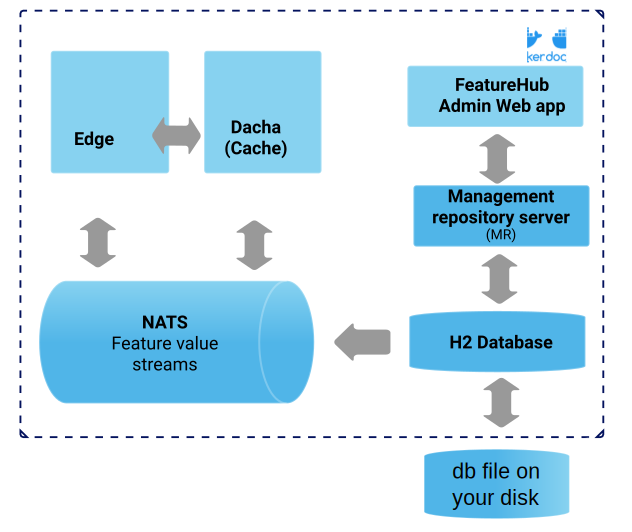

= FeatureHub Documentation
ifdef::env-github,env-browser[:outfilesuffix: .adoc]
:sectlinks:
:toc: left
:toclevels: 2
:toc-title: Contents
:favicon: favicon.ico

++++
<!-- google -->

++++

FeatureHub Team <info@featurehub.io>

Visit us on https://github.com/featurehub-io/featurehub[Github]

image::images/fh_primary_navy.png[Feature Hub,500]

== Overview

https://www.featurehub.io/[FeatureHub] is a Cloud Native platform to help software teams manage their features, from feature flags (also known as feature toggles) to A/B experiments and remote or centralised configuration.
It's an essential ingredient for enabling the feedback loop and feature testing and experimentation in production with real users (see diagram below).

Visit our official web page for more information about the platform https://www.featurehub.io/[here]

Building software with feature management encourages DevOps practices like
https://trunkbaseddevelopment.com[trunk based development], continuous delivery and importantly, separating deployment from release management.
Enabling teams to deliver value to customers early and often, whilst maintaining high quality and keeping risk low.

FeatureHub can be used with small startups through to large enterprises with many applications and teams.
It has an enterprise grade security and permission model, that's intuitive and easy to use, so you can be up and running quickly.

FeatureHub is a self-hosted platform so you can run it on your own infrastructure.

image::images/fh_learn_build_measure.svg[Learn,Build,Measure]

== Installation

There are link:installation{outfilesuffix}[several deployment options] for running FeatureHub. As FeatureHub is packaged as a _Cloud Native_ bundle, all parts are Docker images and are intended to be used with that technology (i.e. Docker/OCI or Kubernetes).

There is a GitHub https://github.com/featurehub-io/featurehub-install[repository] where you can find sample docker-compose style deployment options.

All of the deployment options mount the database volume separately from the main set of containers, allowing you to upgrade your database and versions of FeatureHub without destroying your database.

NOTE: As FeatureHub is an open source project, we test on only a limited number of databases, primarily Postgres.

We provide and maintain database migrations scripts for MySQL/MariaDB, MS SQL Server.

There is also a MariaDB example docker-compose install, and the MariaDB and MySQL drivers are installed in all
server runtimes. Further we include support for Google's Cloud SQL libraries in the base images if you need to
use their secure tunnelling capability.

Other databases can potentially be added, please feel free to lodge a ticket on our Github Issues register, particularly if
you are willing to test it out.

=== Evaluating FeatureHub

If you are just curious to see how FeatureHub works and would like to play with it before deciding which of the
installation options are right for you, start with running this simple line:

on Mac or Windows:

----
docker run -p 8085:8085 --user 999:999 -v $HOME/party:/db featurehub/party-server:latest
----

on Linux:

----
docker run --network host --user 999:999 -p 8085:8085 -v $HOME/party:/db featurehub/party-server:latest
----

NOTE: `$HOME/tmp` is where you wish to store the database (h2).

An alternative is to use the link:installation{outfilesuffix}#_docker_compose_docker_stack[Docker Compose] based
evaluation example if you are familiar with that tool.

You can watch the video with some instructions https://youtu.be/DRVqXJmbvTk[here] or follow the instructions below.

This is what will be running:

NOTE: the dotted edge represents the container boundary.

With the database embedded inside the container, yet storing its files on your local disk, this is very
much an evaluation style of deployment.

This will start FeatureHub Admin Console on port 8085 and you can now register as Super Admin,
then create Portfolios, Applications, Features etc.

Once you have done this, you can then simply run the example app that comes in its own docker container,
so you don't have to create sample app and add SDK code yourself.
The example project consists of a back-end service (Node) and a front-end sample app (React) with some sample features already in place.

==== Running the example

The example will need to know the SDK API Key of your application/environment (which you can find in the FeatureHub Admin Console), and it will need an IP address that the example docker image can get access to.
Find your en0 ip address (you can type: `ifconfig en0` - choose the inet address, Windows will be slightly different) or similar. (Do not use localhost as that will not work)

----
# this is the "client_eval" key used by the example server
export FEATUREHUB_CLIENT_API_KEY="default/82afd7ae-e7de-4567-817b-dd684315adf7/SHxmTA83AJupii4TsIciWvhaQYBIq2*JxIKxiUoswZPmLQAIIWN"
# this is the "server eval" key used by the React front-end
export FEATUREHUB_SERVER_API_KEY="default/d8ba747d-7d3c-4454-9c58-130390848412/5EE3vua1NqY0ez6Zd4TXU7XnsZdAPHtR96XaDmhfegitKGiQ9aCdmtmeNUNPubkRZLJLUUpaC7b05ELk"
export MY_IP=192.168.XX.XX
export FEATUREHUB_EDGE_URL=http://$MY_IP:8085/
docker run --rm -e  FEATUREHUB_EDGE_URL=$FEATUREHUB_EDGE_URL -e FEATUREHUB_CLIENT_API_KEY=$FEATUREHUB_CLIENT_API_KEY -e FEATUREHUB_SERVER_API_KEY=$FEATUREHUB_SERVER_API_KEY -p 5000:5000  featurehub/example_node:1.3.0
----

on Linux, replace the last line with:

----
docker run --network host --rm -e  FEATUREHUB_EDGE_URL=$FEATUREHUB_EDGE_URL -e FEATUREHUB_CLIENT_API_KEY=$FEATUREHUB_CLIENT_API_KEY -e FEATUREHUB_SERVER_API_KEY=$FEATUREHUB_SERVER_API_KEY -p 5000:5000  featurehub/example_node:1.3.0
----

This will kick off the example React app that can be accessed on port 5000. It will also start the "back-end" Node server that runs inside the container on port 8099. Experiment with the sample app - add a few todo's using "lower case" letters.
If you create a feature flag in the FeatureHub Admin Console called `FEATURE_TITLE_TO_UPPERCASE`, unlock it and set it to true. Add another "to-do" and see how items now being served in "upper case" letters. This flag is affecting the Node backend service as this is where the feature is implemented using Typescript FeatureHub SDK.

Now in the FeatureHub Admin Console, if you create a feature of type "String" called `SUBMIT_COLOR_BUTTON` and set its value to  `cyan`, you will see the "Add" button will swap to cyan colour in near real-time.

include::sdks.adoc[]

include::admin-development-kit.adoc[]

== Architecture

Please read link:architecture{outfilesuffix}[for information about the architecture of FeatureHub].

== Key concepts

=== Portfolios

Portfolios are simply a collection of one or more applications.
Typically, portfolios are named to match areas of your business where groups of applications (or application suites) live.
Once created these portfolios can be managed by "Portfolio admins".
There is no limit to the number of portfolios you can have.

image::images/fh_overview.svg[Overview,500]

==== Portfolio groups
You can create one or more groups of people, these groups can be used to set various permissions
on the applications and their environments, within the portfolio. Either use the same groups across applications within the
portfolio, or create separate groups for each application.
Some example groups might be:

* _Developers_ (Typically can create features and change feature values in non-production environments)
* _Testers_ (Typically can change feature values in non-production environments)
* _Operations_ (Typically can't create or delete features but can update values in production)

NOTE: Every Portfolio automatically gets a group called "Administrators", Simply adding people to this group will
make them administrators for this portfolio, and they can do anything in any application within that Portfolio.

=== Applications

Applications are where you create features and environments, they belong inside a portfolio.

=== Environments

Applications have one or more environments, these typically refer to groups of co-operating deployments of your
application in different environments. There are often multiple development environments, testing environments,
acceptance testing and customer demo environments depending on the application.

When an application is created there is always an initial environment
called `Production` created. The values of your features are set, per environment.

Every FeatureHub environment has a unique ID, this ID plus a Service Account is what you reference in your application via the
SDK when you query for the value of the features.

=== Features

Features are the main part of FeatureHub, they can be simple feature flags, strings, numbers or more advanced JSON
formats intended for forms of configuration.

==== Feature types

You can create features of the following types:

* `BOOLEAN` used for basic feature flags (toggles)
* `NUMBER` numerical values
* `STRING` string values
* `JSON` valid JSON only (typically used for remote configuration, or otherwise overriding internal values of an application)

NOTE: future support will exist for YAML and JSON-Schema to ensure valid configuration for JSON and YAML types.

==== Feature key

The feature key is the reference you use in your application, when you use the SDK,
you can check the value of a feature, referencing the feature key.
It *must be unique* for your application.

==== Feature value

When you add a feature flag, this will also automatically create a feature value in each environment. The default feature value will be set to `*off*` for `boolean` type and to `*null*` for `string`, `number` and `json`. By default, each feature value will be locked. Essentially feature value is always associated with an application and an environment for that application.

NOTE: See <<Feature Permissions>> for details on the various permission states a feature can have.

== Rollout strategies and targeting rules

=== Rollout strategies

Rollout strategies provide an ability to rollout features to a limited audience based on targeting rules, for example imagine you have a feature flag of type string which controls a _"button color"_ that can be in multiple states,
e.g green, blue, red etc. With rollout strategies, you can serve a `green` value to users on `iOS` devices,
`blue` value to users whose emails ending with `gmail.com` and `red` value to users whose location is
`New Zealand or United States or United Kingdom`. You can also use percentage based rollouts and for example, turn your feature "on" only to 50% of the audience.

Rollout strategies are created and added per <<Feature value>>. Once you add a strategy you can set a feature value to serve to users that will match this strategy, for example "on" or "off". In case a user doesn't match any of the provided strategies, they will be served a "default value". You can change the default strategy and rollout strategy feature values at any time (given you have permissions).

You can apply zero or more rollout strategies to a feature. Each rollout strategy can be assigned a different feature value.

=== Targeting rules
A rollout strategy consists of one or more targeting rules. The rule can consist of any combination of matching criteria.

Each additional rule is always applied as an `AND` condition - the user is using a mobile device that is iOS `AND`
their country is Australia.

Each rule is essentially a key, a condition (equals, includes, etc) and zero or more values. Whereas each rule
is an `AND` condition, each _value_ is an `OR` condition. For example, if the `country` is `New Zealand` `OR` `Indonesia`
`AND` the custom field `payment_method` is equal to `credit_card` `OR` `direct_debit`.

Each rollout strategy can have zero or more rules associated with it. If it has zero rules and no percentage rule
the strategy will be ignored. There is no limit on how many rules you can apply. There are 3 main rule types: *Preset*, *Custom* and *Percentage split*

=== Targeting rule types

==== Preset

- Country

Available https://www.britannica.com/topic/list-of-countries-1993160[list of countries to match on]

- Device

Available values to match on:
`browser, mobile, desktop, server, watch, embedded`

- Platform

Available values to match on:

`linux, windows, macos, android, ios`

- User Key

For example, can be used to match on email address, partial email address, user id, partial user id or regex.

- Version

Requires to be in semantic version format, e.g. `1.2.0` -  read more about semantic versioning https://semver.org/[here]

==== Custom

If you cannot find a suitable rule from those listed above, you can create your own rule. When setting up a custom rule you will be required to select a rule type.

*Supported custom rules types:*

`string`

`number` - any valid number

`boolean` - true and false

`semantic version` - as per semantic version format. If you are only targeting Java you also get the additional formats supported by Maven and Gradle.

`date` - international format only - ``YYYY-MM-DD ``

`date-time` - international format only - `YYYY-MM-DDTHH:MM:SS.NNN` with an optional timezone, UTC is assumed

`ip-address` - CIDR or specific IP addresses are supported.

Note, if you do not set the value in the _user context_ in the SDK, and the rule indicates to match `blank` value then this rule will evaluate to true.

=== Percentage split rule

As well as setting up targeting rules you can also setup a special rule type - percentage split. Percentage rules lets you rollout a feature value to an approximate percentage of your user base.

A typical scenario for a flag for example would be a "soft launch". The "default value" of your flag would be `off` and you set some arbitrary percentage
to `on` (e.g. 20%). Then you would analyse how your feature is performing for those 20%, collect any user feedback, monitor your logging for any issues and if you are happy you will start
increasing the rollout to more and more people in your user base, eventually setting it to 100%, changing the default to
"on" and removing the strategy. (This is set _per environment_).

In case of multiple rollout strategies assigned to a feature that contain percentage split rules, the sum of all of them cannot be over 100%.
 If you add percentage based rollout strategies that do not add to 100%, then the remainder continues to use the
default value.

You can also use percentage rules to perform *_A-B testing_* or *_run experiments_*. Given FeatureHub provides a GoogleAnalytics connector - you can see the result of your experimentation in the Google Analytics Events dashboard in real time.

Percentage rules can be mixed with other rules, for example a strategy can have a country rule and a percentage rule, e.g. turn on the feature flag to 25% of the audience in New Zealand.

For Percentage rule to work you need to set a `Context` with `sessionId` or `userKey` when implementing feature flags through our SDKs. `userKey` can be anything that identifies your user, e.g `userId`, `email` etc..

NOTE: It is important to note that the percentages are an approximation, the algorithm works by taking user _Context_ data you provide
in SDK in the client side (either a `sessionId` or a `userKey`, ideally consistent for the user across platforms) and it uses
an algorithm to spread that across a range giving you control down to four decimal points, but the algorithm is more accurate
the greater the number of clients you have. i.e. you can rollout to 0.0001% of your usage base if you wish.
If you only have five users, this probably won't turn it on for anyone, if you have a million it will
be more accurate.

== Security

FeatureHub was designed to ensure that security was built into the platform from the ground up. If we split this into authentication vs authorization FeatureHub provides two primary methods for authentication: a login, by which someone is able to get a bearer token and then uses the FeatureHub Admin Console, or a Service account, by which SDKs are able to read (and potentially) update states of features.

=== Key Security concepts

==== Administrators
There are two types of administrators, *Site Administrators* and *Portfolio Administrators*.

===== Site Administrators
* *Site Administrators* can:
** Create and manage users of the system
** Create and manage portfolios

===== Portfolio Administrators
* *Portfolio Administrators* can:
** Create and manage portfolio groups
** Create applications
** Manage access to applications
** Create Service Accounts

NOTE: Every Portfolio automatically gets a group called "Administrators", Simply adding people to this group
will make them administrators for this portfolio.

==== Feature Permissions
For each application environment, there are permissions you can assign to portfolio groups or service accounts.

* `READ` Can see the value of a feature
* `LOCK` Can lock a feature, so it's value can't be changed, this gives us a
safety net when deploying incomplete code into production.
(Typically developers and testers keep features locked until they are finished and ready to be set)
* `UNLOCK` Can unlock a feature, so it's value can be changed
* `CHANGE_VALUE` Can change the value of a feature

NOTE: Groups can also separately be assigned the permission to create, edit and delete entire features.

=== Service Accounts

Service accounts are used for programmatic access to the features for an application through FeatureHub SDKs.
A service account will need a minimum of `READ` access to an environment in order to access a feature value. You can set permissions for a service account from the FeatureHub Admin Console.

When a service account is given access for an environment for a selected application, it automatically creates two types of API keys that you can choose from *Client Evaluated API Key* and *Server Evaluated API Key*. Read more info on API Keys types https://docs.featurehub.io/#_client_and_server_api_keys[here]

The same service account can be used across multiple environments and applications. We recommend two service accounts be created for an application, one with access to a production environment and the other one for test environments. However, FeatureHub remains flexible to how customers could split their service accounts according to individual needs.

In case an API key gets compromised there is an option to reset the key and immediately disable the previous one.

NOTE: Because API Keys are based on a service account ID, it is not possible to reset a single API key at a time, but there is an option to reset service account ID, which in turn will cause reset to all API keys attached to that service account. This could potentially affect multiple applications and multiple environments. Thus, it is recommended to always have a separate Service Account for a production environment.
There is also an option to either reset Client evaluated API keys or Server evaluated API keys. Warning is provided before the reset.
The option to reset the keys will only be available to Portfolio admins, since service accounts settings can only be viewed by them. Only Portfolio and Super admins always have full permissions to see in which apps and environments a service account is used.

== External Identity

FeatureHub supports external link:identity{outfilesuffix}[identity providers].

== Analytics

Please read the following link:analytics{outfilesuffix}[for information about Analytics]

== Contributors Documentation
=== SDK Contributors
Please read link:sdks-development{outfilesuffix}[for information about Developer Setup]

=== FeatureHub Backend Services Setup

Please read link:developers{outfilesuffix}[for information about Developer Setup]
