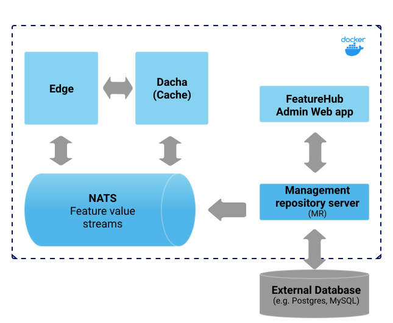

= FeatureHub Documentation
FeatureHub Team <info@featurehub.io>
:toc: left
:toclevels: 4
:toc-title: Contents

Visit us on https://github.com/featurehub-io/featurehub[Github]

== Overview

FeatureHub is a platform to help software teams manage and their features, from feature flags (also known as feature toggles) to A/B experiments and remote or centralised configuration management.
It's an essential ingredient for enabling the feedback loop see diagram below).

Building software with feature management encourages DevOps practices like
https://trunkbaseddevelopment.com[trunk based development], continuous delivery and importantly, separating deployment from releasing.
Enabling teams to deliver value to customers early and often, whilst maintaining high quality and keeping risk low.

FeatureHub can be used with small startups through to large enterprises with many applications and teams.
It's has an enterprise grade security and permission model, that's intuitive and easy to use, so you can be up and running quickly.

image::images/fh_learn_build_measure.svg[Learn,Build,Measure]

== Architecture
FeatureHub architecture is designed for various different implementation sizes and scales.
Fundamentally there is a separation of concerns of all the main components, so they can be scaled independently
as and when needed.

image::images/fh_architecture.svg[Architecture,600]

== Installation
There are 3 main deployment options for running FeatureHub.
//TODO details of how to configure each deployment option

=== Option 1 - Simple Deployment
This is the most basic option recommended for getting started quickly.
It uses one Docker container for the entire stack and has an embedded H2 database.
You will need to mount and external volume to persist your database.

image::images/fh_deployment_option_1.svg[Option 1,500]
NOTE: H2 is not generally considered scalable and doesn’t have online backup and restore tools.

=== Option 2 - Low Volume Deployment
This is the same as the Simple install except you use a separate Database of your choice.
This option is good for moderate usage applications where you're not expecting a
large volume of feature value requests, from the application.

NOTE: FeatureHub runs on any standard SQL Database including PostgreSQL, MySQL, MS SQL Server, Oracle.

=== Option 3 - Scalable Deployment
This option is best if you want to run FeatureHub at scale. Running separate instances of Edge, Cache, NATS and
FeatureHub Server, means you can deploy these components independently for scalability and redundancy.

image::images/fh_deployment_option_3.svg[Option 3,500]
NOTE: Inorder to scale FeatureHub Server, you need to have first configured a separate database
(see <<Option 2 - Low Volume Deployment>> above).

== Key concepts
=== Portfolios
Portfolios are simply a collection of one or more applications.  Typically, portfolios are named to match areas of your
business where groups of applications (or application suites) live.  Once created these portfolios
can be managed autonomously (via <<_portfolio_administrators>>) from the rest of FeatureHub.

image::images/fh_overview.svg[Overview,500]

==== Portfolio groups
You can create one or more groups of people, these groups can be used to set various permissions
on the applications and their environments, within the portfolio.  Either use the same groups across application within the
portfolio, or create separate groups for each application.
Some example groups might be:

* _Developers_ (Typically can create features and change feature values in non-production environments)
* _Testers_ (Typically can change feature values in non-production environments)
* _Operations_ (Typically can't create or delete features but can update values in production)

NOTE: Every Portfolio automatically gets a group called "Administrators", Simply adding people to this group will make them administrators for this portfolio.

=== Applications

Applications are where you create features and environments, they belong inside a portfolio.

=== Environments

Applications have one or more environments.
When an application is created there is always an initial environment called `Production` created.
The values of your features are set, per environment.

Every FeatureHub environment has a unique ID, this ID is what you reference in your application via the SDK when you query for the value of a feature you must use this environment ID.

=== Features

Features are the main part of FeatureHub, they can be simple feature flags or more advanced JSON formats.

==== Feature types

You can create features of the following types:

* `BOOLEAN` used for basic feature flags (toggles)
* `NUMBER` numerical values
* `STRING` string values
* `JSON` valid JSON only (typically used for remote configuration)
* `YAML` valid YAML only (typically used for remote configuration)

==== Feature key

The feature key is the reference you use in your application, when you use the SDK,
you can check the value of a feature, referencing the feature key.
It *must be unique* for your application.

NOTE: See <<Feature Permissions>> for details on the various states a feature can have.

== Security

=== Key Security concepts
==== Administrators
There are two types of administrators, *Site Administrators* and *Portfolio Administrators*.

===== Site Administrators
* *Site Administrators* can:
** Create and manage users of the system
** Create and manage portfolios

===== Portfolio Administrators
* *Portfolio Administrators* can:
** Create and manage portfolio groups
** Create applications
** Manage access to applications
** Create Service Accounts

NOTE: Every Portfolio automatically gets a group called "Administrators", Simply adding people to this group will make them administrators for this portfolio.

==== Service Accounts

Service accounts are used for programmatic access to the features for an application.
A service account will need a minimum of `READ` access to an environment in order to access a feature value.

==== Feature Permissions
For each application environment, there are permissions you can assign to portfolio groups or service accounts.

* `READ` Can see the value of a feature
* `LOCK` Can lock a feature, so it's value can't be changed, this gives us a
safety net when deploying incomplete code into production.
(Typically developers and testers keep features locked until they are finished and ready to be set)
* `LOCK` Can unlock a feature, so it's value can be changed
* `EDIT` Can change the value of a feature

NOTE: Groups can also separately be assigned the permission to create, edit and delete entire features.

include::analytics.adoc[]

include::developers.adoc[]