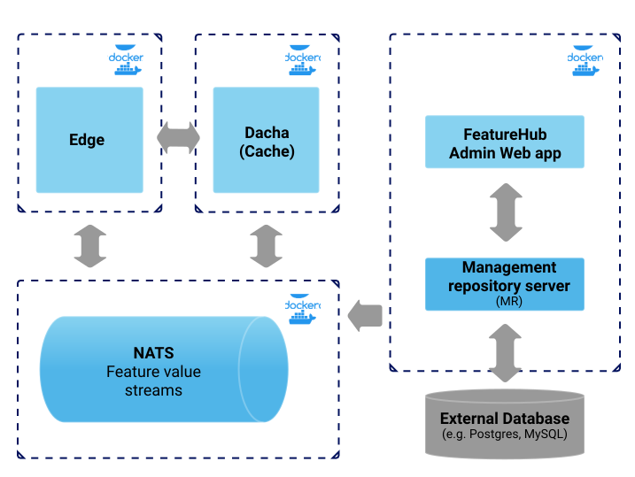

= FeatureHub Documentation
FeatureHub Team <info@featurehub.io>
ifdef::env-github,env-browser[:outfilesuffix: .adoc]
:toc: left
:toclevels: 4
:toc-title: Contents

Visit us on https://github.com/featurehub-io/featurehub[Github]

== Overview

FeatureHub is a Cloud Native platform to help software teams manage and their features, from feature flags 
(also known as feature toggles) to A/B experiments and remote or centralised configuration management.
It's an essential ingredient for enabling the feedback loop see diagram below).

Building software with feature management encourages DevOps practices like
https://trunkbaseddevelopment.com[trunk based development], continuous delivery and importantly, 
separating deployment from releasing. Enabling teams to deliver value to customers early and often, 
whilst maintaining high quality and keeping risk low.

FeatureHub can be used with small startups through to large enterprises with many applications and teams.
It's has an enterprise grade security and permission model, that's intuitive and easy to use, 
so you can be up and running quickly.

FeatureHub aims to have the greatest range of options available for the software community, from the ability to run
it self hosted, through to a SaaS platform, allowing you to start small and hosted, grow and self host, and then
deciding to outsource your continually growing feature management as you get more successful. 

image::images/fh_learn_build_measure.svg[Learn,Build,Measure]

== Architecture

Please read link:architecture{outfilesuffix}[for information about the architecture of FeatureHub].

== Installation
There are 3 main deployment options for running FeatureHub. As FeatureHub is packaged as a _Cloud Native_
bundle, all parts are Docker images and are intended to be used with that technology (i.e. Docker or Kubernetes).

All sample configurations are in the `run-configurations` folder. All of the run configurations mount the 
database volume separately from the main set of containers, allowing you to upgrade your database and
versions of FeatureHub without destroying your database.

NOTE: FeatureHub runs on the following SQL Databases: PostgreSQL, MySQL, MS SQL Server, Oracle and we provide
initialization and migration DDL for each of these databases. Others can be supported, please contact us.

=== Option 1 - Evaluation Deployment
This is the most basic option recommended for getting started quickly, and is the example we use in demos.

It uses one Docker container for the entire stack and works with all supported databases
baked in. The two web endpoints of interest -  the Management Server and the Edge layer that client
SDKs talk to - are all served from the same web server . 

This deployment, with an attached Docker volume for the database, is not recommended for production usage,
it is only really for demonstration and evaluation purposes.

We provide two evaluation examples - one for H2 and one for Postgres, the configurations for these are 
`run-configurations/all-in-one-h2` and `run-configurations/all-in-one-postgres` respectively.

image::images/fh_deployment_option_1.svg[Option 1,500]

NOTE: H2 and Postgres are the two databases we test actively with.

=== Option 2 - Low Volume Deployment
In this deployment, all components (MR, Dacha, NATS, Edge) are split into separate Docker containers, but 
`docker-compose` runs them all in the same server. This example is intended to show you how you can 
split and separate the configuration for each of these pieces. 

Because they are deployed in separate containers, you have considerably greater control over what 
network traffic gains access to each of these pieces, and they do not all sit under the same Web server. However
because they run in a single Docker-Compose, they must run on different ports, which means you will need further
configuration to expose them in a normal organisation.

NOTE: In this `docker-compose` image, there is a database along with an initialization script. If you are wishing
to seriously use this, you will need to run an external database.

=== Option 3 - Scalable Deployment
This option is best if you want to run FeatureHub at scale. Running separate instances of Edge, Cache, NATS and
FeatureHub Server, means you can deploy these components independently for scalability and redundancy. 

NOTE: Inorder to scale FeatureHub Server, you need to have first configured a separate database
(see <<Option 2 - Low Volume Deployment>> above).

== Key concepts
=== Portfolios
Portfolios are simply a collection of one or more applications.  Typically, portfolios are named to match areas of your
business where groups of applications (or application suites) live.  Once created these portfolios
can be managed autonomously (via <<_portfolio_administrators>>) from the rest of FeatureHub. There is no limit to
the number of portfolios you can have.

image::images/fh_overview.svg[Overview,500]

==== Portfolio groups
You can create one or more groups of people, these groups can be used to set various permissions
on the applications and their environments, within the portfolio.  Either use the same groups across applications within the
portfolio, or create separate groups for each application.
Some example groups might be:

* _Developers_ (Typically can create features and change feature values in non-production environments)
* _Testers_ (Typically can change feature values in non-production environments)
* _Operations_ (Typically can't create or delete features but can update values in production)

NOTE: Every Portfolio automatically gets a group called "Administrators", Simply adding people to this group will 
make them administrators for this portfolio, and they can do anything in any application within that Portfolio.

=== Applications

Applications are where you create features and environments, they belong inside a portfolio.

=== Environments

Applications have one or more environments, these typically refer to groups of co-operating deployments of your
application in different environments. There are often multiple development environments, testing environments, 
acceptance testing and customer demo environments depending on the application. 

When an application is created there is always an initial environment 
called `Production` created. The values of your features are set, per environment. 

Every FeatureHub environment has a unique ID, this ID plus a Service Account is what you reference in your application via the 
SDK when you query for the value of the features.

=== Features

Features are the main part of FeatureHub, they can be simple feature flags, strings, numbers or more advanced JSON 
formats intended for forms of configuration.

==== Feature types

You can create features of the following types:

* `BOOLEAN` used for basic feature flags (toggles)
* `NUMBER` numerical values
* `STRING` string values
* `JSON` valid JSON only (typically used for remote configuration, or otherwise overriding internal values of an application)

NOTE: future support will exist for YAML and JSON-Schema to ensure valid configuration for JSON and YAML types.

==== Feature key

The feature key is the reference you use in your application, when you use the SDK,
you can check the value of a feature, referencing the feature key.
It *must be unique* for your application.

NOTE: See <<Feature Permissions>> for details on the various states a feature can have.

== Security

=== Key Security concepts
==== Administrators
There are two types of administrators, *Site Administrators* and *Portfolio Administrators*.

===== Site Administrators
* *Site Administrators* can:
** Create and manage users of the system
** Create and manage portfolios

===== Portfolio Administrators
* *Portfolio Administrators* can:
** Create and manage portfolio groups
** Create applications
** Manage access to applications
** Create Service Accounts

NOTE: Every Portfolio automatically gets a group called "Administrators", Simply adding people to this group 
will make them administrators for this portfolio.

==== Service Accounts

Service accounts are used for programmatic access to the features for an application.
A service account will need a minimum of `READ` access to an environment in order to access a feature value.

==== Feature Permissions
For each application environment, there are permissions you can assign to portfolio groups or service accounts.

* `READ` Can see the value of a feature
* `LOCK` Can lock a feature, so it's value can't be changed, this gives us a
safety net when deploying incomplete code into production.
(Typically developers and testers keep features locked until they are finished and ready to be set)
* `UNLOCK` Can unlock a feature, so it's value can be changed
* `CHANGE_VALUE` Can change the value of a feature

All feature flags are automatically created in all environments, set to "off" and locked. 

NOTE: Groups can also separately be assigned the permission to create, edit and delete entire features.

== Analytics

Please read the following link:analytics{outfilesuffix}[for information about Analytics]

== Developer Setup

Please read link:developers{outfilesuffix}[for information about Developer Setup]
