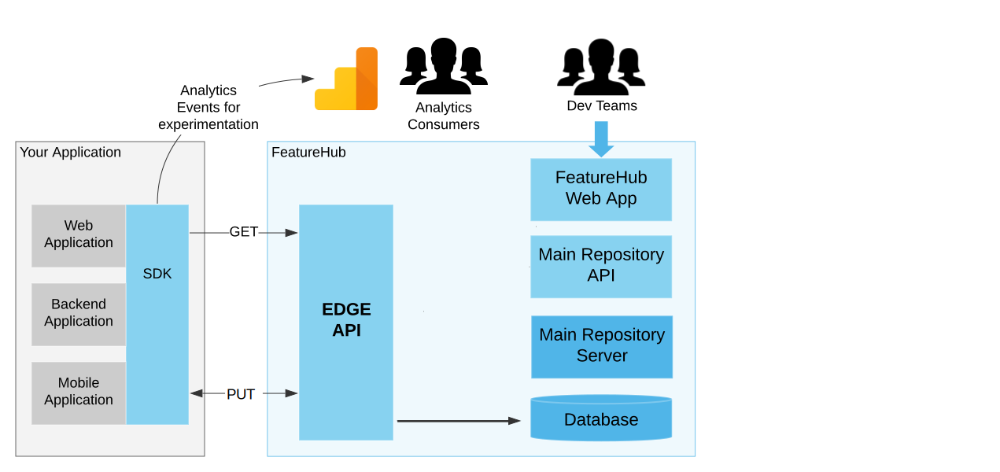

= Installation of FeatureHub
:favicon: favicon.ico
ifdef::env-github,env-browser[:outfilesuffix: .adoc]
:toc: left
:toclevels: 4
:toc-title: Contents
:google-analytics-code: UA-173153929-1

link:index{outfilesuffix}[Back to index]

== Overview

As explained in the link:architecture.adoc[Architecture] section, there are a number of different combinations
for deployment of FeatureHub and they typically focus on _where_ you will deploy the infrastructure, _how_ you want
your clients to use it and _how much_  use it will get. FeatureHub as of 1.5.0 is designed to support 
very low use cases of only hundreds of requests a day up to tens of millions of requests a day or more.

For a link:architecture.adoc#_streaming[streaming deployment], you will need to deploy the full stack and have your own database - this
means a combination of MR, Dacha, Edge, NATS and if you are using it, nginx (which holds the web app). As a separate
deployment, this is easily done with Kubernetes and our Helm charts.

When these services are combined into one this is called the *Party Server*. This kind of deployment is more 
suitable for docker-compose on a Cloud Server
or ECS style deploys.  

For a link:architecture.adoc#_non_streaming[non-streaming deployment], you need to deploy (again with your database) 
only MR and Edge-Rest (a new service as per 1.5.0). When
these are deployed together they are called *Party Server-_ish_*, but they can be deployed separately.

We go into these options in more detail below along with the configuration options that make them work.

[options="header"]
|===================================
|Streaming|How Much Use|Recommendation
|Yes|Low|Suits a simple container deployment platform like ECS, Compute Engine with a single Docker instance and using Party Server
|Yes|Mid-High|Suits a Kubernetes deployment like GKS,EKS,AKS or a more complex ECS based deploy and using Edge/Dacha deployed separately from Admin App
|No|Low|Suits a Party-Server-_ish_ deployment with a single database on Cloud Run or Azure Container Instances. Could also deploy to platform like ECS or Compute Engine but less cost-effective.
|No|Mid|Suits a MR deployment with a single master and one or more read replicas, with Edge-Rest pointed at the read replicas. 
|===================================

=== Option 1b - Low Volume Deployment (Non-streaming)

In this case, this deployment, known as `party-server-ish` is different from the evaluation image, and deploys only the Management
Repository and a version of Edge that talks to the database. The `party-server-ish` serves the website, Admin App and Edge applications
running inside a single process. There is no nginx, NATS or Dacha, and no SSE based
streaming capability available.

This kind of option is suitable if you are only using GET requests  (being
able to use the test API to update features remains available), such as for
mobile or Web applications.

As with all deploys, you can configure a read replica for each container, and
Edge requests will hit the replica by default.

This kind of deployment is suitable for a scaling container like deployment.

You can deploy this configuration in separate pieces however, with
just the Management Repository (the Admin app) in one container talking
to the database, and the Edge REST container also talking directly
to the database under a different configuration.

=== Option 2 - Scalable Deployment

image::images/fh_deployment_option_3.svg[Option 2,500]

This option is best if you want to run FeatureHub in production at scale. Running separate instances of Edge, Cache, NATS and
FeatureHub Server, means you can deploy these components independently for scalability and redundancy.

In order to scale FeatureHub Server, you need to have first configured a separate database. We provide an installation option for this with Postgres database:

`cd featurehub-install-featurehub-1.4.1/docker-compose-options/all-separate-postgres`

`docker compose up`

There is also a helm chart available for production Kubernetes deployment. Please follow documentation link:https://github.com/featurehub-io/featurehub-install/tree/master/helm[here]

In this deployment, all components (MR, Dacha, NATS, Edge) are split into separate Docker containers, but
`docker compose` runs them all in the same server. This example is intended to show you how you can
split and separate the configuration for each of these pieces.

Because they are deployed in separate containers, you have considerably greater control over what
network traffic gains access to each of these pieces, and they do not all sit under the same Web server. However,
because they run in a single Docker-Compose, they must run on different ports, which means you will need further
configuration to expose them in a normal organisation. This type of deployment is recommended for low volume traffic.

== Configuration

In the https://github.com/featurehub-io/featurehub-install/tree/master/docker-compose-options[deployment options]  configurations you will see that each server has
a set of possible external configurations. If you wish to build and rebundle the images yourself you can easily do this,
the base images, exposed ports and so forth are all configurable as part of the build.

NOTE: As of 1.4.1, all properties that are configured using `properties` files below can also be specified using environment
variables - but use the exact upper case variant. E.g. `db.url` becomes `DB.URL`, `passwordsalt.iterations` becomes
`PASSWORDSALT.ITERATIONS`. If you are running your FeatureHub on AWS ECS you will need to use environment variables
for configuration.

=== Run configuration

By this we mean the properties you can set to control the behaviour of different servers.

==== Database configuration

All subsystems that talk to the database take these parameters. Even if 
you are using environment variables, we recommend using lower case 
so the database connections are correctly configured. All `db.` prefixes
can also use `db-replica` prefixes to configure a read replica,
where it is and how it should be connected to.

- `db.url` - the jdbc url of the database server.
- `db.username` -  the username used to log in.
- `db.password` - the password for the user
- `db.minConnections` - the minimum number of connections to hold open
- `db.maxConnections` - the maximum connections to open to the db
- `db.pstmtCacheSize` - the prepared statement cache size

The library we use - ebean - supports a number of other configuration
parameters

=== NATS

If you are using the Streaming version of FeatureHub, then you may
need to configure your NATS urls. If you have only once instance of a 
party-server, you can leave it as the default.  If you have deployed
Option 2, or you have multiple servers with Option 1a, you will need to make sure  your NATS
servers are configured correctly.

- `nats.urls` - a comma separated list of NATs servers. 

NATS works by having the clients tell the servers where each other
are, so the NATS servers need to be routable but do not need to 
be explicitly told about each other.

==== Management Repository

The following properties can be set:

- `passwordsalt.iterations` (1000) - how many iterations it will use to salt passwords
- `cache.pool-size` (10) - how many threads it will allocate to publishing changes to Dacha and SSE
- `feature-update.listener.enable` (true) - whether this MR should listen to the same topic as the Dacha's and respond if they are empty
-  `environment.production.name` (production) - the name given to the automatically created production environment. It will
be tagged "production".
- `environment.production.desc` (production) - the description field for same.
- `register.url` - the url used for registration. The front-end should strip the prefix off this and add its own relative one. The format has to
be `register.url=http://localhost:8085/register-url?token=%s` - if your site is `https://some.domain.info` for example, it would
be `register.url=https://some.domain.info/register-url?token=%s`
- `portfolio.admin.group.suffix` ("Administrators") - the suffix added to a portfolio group when a portfolio is created
for the first time, it needs an Admin group. So a portfolio called "Marketing" would get an admin group called "Marketing Administrators"
created.

==== Dacha Config

The following properties can be set (that are meaningful):

- `nats.urls` - a comma separated list of NATs servers
- `cache.timeout` - how long the server will attempt to find and resolve a master cache before moving onto the next step (in ms, default = 5000)
- `cache.complete-timeout` - how long it will wait after another cache has negotiated master before it expects to see data (in ms, default = 15000)
- `cache.pool-size` - the number of threads in pool for doing "work" - defaults to 10

=== Edge (all) Config
- `jersey.cors.headers` - a list of CORS headers that will be allowed, specifically for browser support
- `update.pool-size` (10) - how many threads to allocate to processing incoming updates from NATs. These are responses to feature
requests and feature updates coming from the server.

==== Edge (Streaming) Config

- `nats.urls` - a comma separated list of NATs servers
- `listen.pool-size` (10) - how many threads to allocate to processing incoming requests to listen. This just takes the request,
decodes it and sends it down via NATs and releases.
- `maxSlots` (30) - how many seconds a client is allowed to listen for before being kicked off. Used to ensure connections
don't go stale.
- `dacha.url.<cache-name>` = url - this is only relevant if you are running split servers - so Dacha and Edge run in their own containers. You
need to tell Edge where Dacha is located. The default cache is called `default, so it will expect one called `dacha.url.default` and the url. In the
sample docker-compose where they are split, the hostname for Dacha is `dacha`, so this is `dacha.url.default=http://localhost:8094`. This isn't
required for the Party Server because communication is internal.

==== Edge (REST only) Config

Edge REST uses the database, so it also needs the database config. Edge-REST
is bundled as a separate container, so it can be run and exposed directly
instead of being exposed along with the Admin site.

==== Party Server

The party server honours all values set by the Management Repository, Dacha and the SSE-Edge.

==== Party-Server-ish

The `party-server-ish` honours all the values set by the Management Repository  and Edge REST.

==== Common to all servers

All servers expose metrics and health checks. The metrics are for Prometheus and are on `/metrics`,
liveness is on `/health/liveness` and readyness on `/health/readyness`. Each different server has a collection
of what things are important to indicate aliveness. The `server.port` setting will expose these endpoints,
which means they are available to all of your normal API endpoints as well. In a cloud-native environment,
which FeatureHub is aimed at, this is rarely what you want. So FeatureHub has the ability to list these
endpoints on a different port.

- `monitor.port` (undefined) - if not defined, it will expose the metrics and health on the server port.
If not, it will expose them on this port (and not on the server port).

All servers expose quite extensive metrics for Prometheus.

==== Common to Party, SSE Edge and Management Repository

- `server.port` (8903) - the server port that the server runs on. it always listens to 0.0.0.0 (all network interfaces)
- `server.gracePeriodInSeconds` (10) - this is how long the server will wait for connections to finish after it has stopped
listening to incoming traffic

Jersey specific config around logging is from here: https://github.com/ClearPointNZ/connect-java/tree/master/libraries/jersey-common[Connect jersey Common]

- `jersey.exclude`
- `jersey.tracing`
- `jersey.bufferSize` (8k) - how much data of a body to log before chopping off
- `jersey.logging.exclude-body-uris` - urls in which the body should be excluded from the logs
- `jersey.logging.exclude-entirely-uris` - urls in which the entire context should be excluded from the logs. Typically
you will include the /health/liveness and /health/readyness API calls along with the /metrics from this. You may also
wish to include login urls.
- `jersey.logging.verbosity` - the default level of verbosity for logging `HEADERS_ONLY, - PAYLOAD_TEXT, - PAYLOAD_ANY`

== Runtime Monitoring

=== Prometheus

The Prometheus endpoint is on /metrics for each of the servers. It is exposed on the Party and MR Servers by default.

=== Health and Liveness checks

A server is deemed "Alive" once it is in STARTING or STARTED mode. It is deemed "Ready" when it is in STARTED mode. All
servers put themselves into STARTING mode as soon as they are able, and then STARTED once the server is actually
listening. The urls are:

- `/health/liveness`
- `/health/readyness`

== Deployment Options

=== Docker-Compose / Docker-Stack

To get you up and going quickly, we have created a number of different Docker options using Docker-Compose.

You can check for the latest versions https://github.com/featurehub-io/featurehub-install/releases[here]

`curl -L https://github.com/featurehub-io/featurehub-install/archive/refs/tags/featurehub-1.4.1.tar.gz | tar xv`

Make sure you have your docker server running and docker-compose installed if you are using it (or your swarm
set up if you are using docker stack). These example stacks are great for experimenting on to understand what the
different capabilities of the FeatureHub stack are - for example read replica databases, OAuth2 configuration for your
provider, multiple NATs servers and so forth. 

There are a number of different options:

- https://github.com/featurehub-io/featurehub-install/tree/master/docker-compose-options/all-in-one-h2[*Easy Evaluation*] - this refers to
the same evaluation deployment but where the database is mounted in a Docker volume. It reduces the commands you need to type
to get the external file based database evaluation deployment running, but otherwise isn't that
- https://github.com/featurehub-io/featurehub-install/tree/master/docker-compose-options/all-in-one-postgres[*All-In-One Postgres*] - this refers to
the Party Server, documented above, with full streaming services but using an external Postgres database. It is intended to be
documentation for how you can configure and use your Postgres database with FeatureHub, the necessary init scripts and configuration.
- https://github.com/featurehub-io/featurehub-install/tree/master/docker-compose-options/all-in-one-mysql[*All-In-One MySQL*] - this refers to
the same deployment as the Party Server for Postgres, but for MySQL and MariaDB.
- https://github.com/featurehub-io/featurehub-install/tree/master/docker-compose-options/all-separate-postgres[*All Separate Postgres*] - this shows how each of the pieces of a FeatureHub with Streaming Support can be set up. It brings up the Admin App (MR), the cache (Dacha), the
Edge server, the distributed bus (NATs) and the database all as separate services. Edge runs on a different port to the Admin App and shows
how you can use a different URL to serve traffic for feature consumers from your Admin App. 
- https://github.com/featurehub-io/featurehub-install/tree/master/helm[*All Separate Kubernetes*] - this is the same as the All Separate
Postgres above, but is the full Helm chart recommended for Kubernetes. It doesn't include a Postgres or NATs server as generally your cloud
provider will have a managed Postgres service, and NATs have their own Kubernetes Helm charts for scalable, reliable deploys. 

We are hoping for community contributions for ECS deployments.

For example, for the _Easy Evaluation_ option you would do something like this:

`cd featurehub-install-featurehub-1.4.1/docker-compose-options/all-in-one-h2`

`docker compose up`

This will install all the necessary components including FeatureHub Admin Console. You can now load it on http://localhost:8085

What makes it only an evaluation option is simply the database used, it writes to the local
disk and is not intended to be used for a long running or highly performant, concurrent system.

=== Kubernetes

=== Google Cloud Run

Google Cloud Run lets you spin up a container instance and multiplex requests to it, making it directly available as 
soon as you have configured it. These are basic instructions on how to do this.

==== Create your Cloud SQL Instance
In this example we use the instance of Postgres 13 of the smallest possible size and deploy a 2 cpu, 512Mb Cloud
Run instance that scales from 0 to 3, allowing up to 400 incoming requests concurrently per instance. Each CPU
for incoming Edge requests is capable of supporting around 200 concurrent requests. The CPU of the database
affects the speed at which the instances respond - for example we were only able to sustain around 50 requests per
second (with around a 650ms time per request) with a 0.6 CPU database.

----
export GCP_REGION=us-east1
export GCP_ZONE=us-east1-b
gcloud config set project featurehub-saas
gcloud config set compute/zone $ZONE
----

We are now going to create a Cloud SQL database, so you need to 
choose a root password, a database name and a schema name. We will create a very small instance that is zonal only, has no daily backup, and connectivity via public IP but SSL - https://cloud.google.com/sql/pricing[Cloud SQL pricing] give you more details on how much this will cost. Obviously you can choose a larger one, but this initial deployment will probably be
throwaway as it is quite easy. _This step takes a while_

----
export FH_DB_NAME=featurehub-db
export FH_DB_PASSWORD=FeatureHub17#
export FH_DB_SCHEMA=featurehub

gcloud sql instances create $FH_DB_NAME --database-version=POSTGRES_13 --zone=$GCP_ZONE --tier=db-f1-micro "--root-password=$FH_DB_PASSWORD" --assign-ip --require-ssl --storage-type=SSD
----

this should just show you a database schema called postgres
----
gcloud sql databases list --instance=$FH_DB_NAME
----
Now create the new featurehub database schema
----
gcloud sql databases create $FH_DB_SCHEMA --instance $FH_DB_NAME
----
now get the "connection name" - it is the `connectionName` parameter from this:
----
gcloud sql instances describe $FH_DB_NAME
----

You need it in the custom properties below. In my case this was

----
backendType: SECOND_GEN
connectionName: featurehub-example:us-central1:featurehub-db
databaseVersion: POSTGRES_13
...
----

this becomes the name you pass to the container

----
export FH_DB_CONN_NAME=featurehub-example:us-central1:featurehub-db
----

==== Create your Cloud Run deployment
Now you are going to have to do this step twice, because you don't know the URL it will give you and you will
need to specify a _registration url_ if you aren't using OAuth2 (which we recommend). So for the first
deploy we will set the registration url to a fake url (`HOST_URL`).

<TODO:replace with public docker image>
----
export FH_CR_NAME=featurehub
export FH_IMAGE=us-central1-docker.pkg.dev/featurehub-saas/saas-images/party-server-ish:1.5.0-RC1 
export HOST_URL=http://localhost
gcloud run deploy $FH_CR_NAME --image=$FH_IMAGE --min-instances=0 --max-instances=3 --cpu=2 --memory=512Mi --port=8085 --concurrency=400 "--set-env-vars=db.url=jdbc:postgresql:///$FH_DB_SCHEMA,db.username=postgres,db.password=$FH_DB_PASSWORD,db.minConnections=3,db.maxConnections=100,monitor.port=8701,db.customProperties=cloudSqlInstance=$FH_DB_CONN_NAME;socketFactory=com.google.cloud.sql.postgres.SocketFactory,register.url=$HOST_URL/register-url?token%3D%s" --set-cloudsql-instances=$FH_DB_NAME --platform=managed --region=$GCP_REGION --allow-unauthenticated
----

Once it deploys, you will get the service url it gives you back and add it as the registration url and redeploy.

It gave me this for example, `https://featurehub-ixscqgruca-uc.a.run.app` and so now I need to set the registration
url to `register.url=https://featurehub-ixscqgruca-uc.a.run.app/register-url?token=%s` by adding an extra
environment variable to the list passed above. So this would change my command to this:

----
export HOST_URL=https://featurehub-ixscqgruca-ue.a.run.app
----

now run the previous gcloud deploy command again.

If you are using OAuth2, then you will need to set those properties, and we recommend setting your `oath2.disable-login` to true to 
prevent being able to login without an OAuth2 connection.

Use the example Cloud Shell to ensure you can connect to it, but it can take a while to create. During this process, 
create a database called `featurehub` - the server never creates a database, it always expects one to exist and be passed
in the database connection string. 

==== Cloud Run Observations

- We are putting the password straight into the environment variable which isn't recommended, but _#yolo_.
- You should create a service account with minimal permissions for your Cloud Run instances and use that

== Build

Each of the different options, SSE-Edge, Dacha, the Management Repository and the Party Server build docker images
when called from Maven with a cloud image profile.

Make sure the developer build has been completed with:

----
cd backend && mvn -f pom-first.xml clean install && cd .. &&  mvn -T4C clean install
----

If you wish to do individual builds, which we recommend if you are overriding base images and so forth, cd into
those folders. First you will need to make sure the front end builds - it normally builds and installs as part of the
whole build process. Go into the `admin-frontend` folder and type:

----
mvn -Ddocker-cloud-build=true clean install
----

This is a docker build using a Flutter image of the front-end.

Then jump into your chosen folder and your command is:

----
mvn -Ddocker-cloud-build=true -Dapp.baseimage=docker://featurehub/base_mr:1.7 -Dapp.port=8085 -Dbuild.version=0.0.1 clean package
----

Where the `app.baseimage`, `app.port` and `build.version` are the versions you specify. The `docker://` prefix just means
it will pull it from Docker. It is using `jib` from Google, so you may wish to further play around with those settings.

