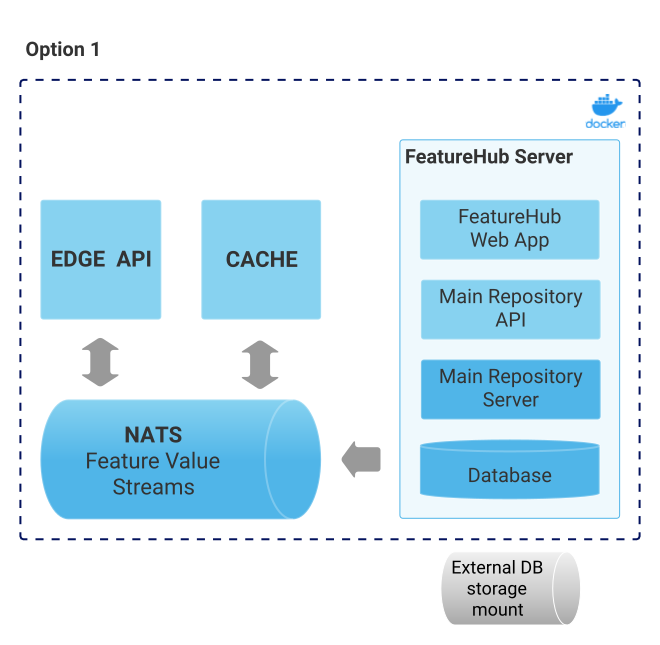
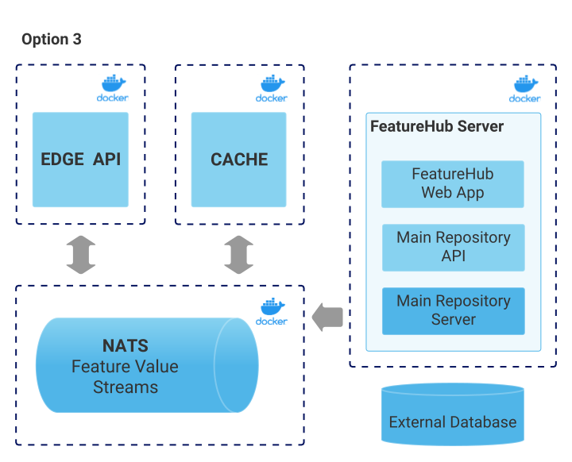

= Installation of FeatureHub
ifdef::env-github,env-browser[:outfilesuffix: .adoc]
:toc: left
:toclevels: 4
:toc-title: Contents

link:index{outfilesuffix}[Back to index]

== Deployment options

=== Option 1 - Evaluation Deployment
This is the most basic option recommended for getting started quickly, and is the example we use in demos.

It uses one Docker container for the entire stack and works with all supported databases
baked in. The two web endpoints of interest -  the Management Server and the Edge layer that client
SDKs talk to - are all served from the same web server .

This deployment, with an attached Docker volume for the database, is not recommended for production usage,
it is only really for demonstration and evaluation purposes.

We provide two evaluation examples - one for H2 and one for Postgres, the configurations for these are
`run-configurations/all-in-one-h2` and `run-configurations/all-in-one-postgres` respectively.

NOTE: H2 and Postgres are the two databases we test actively with.

=== Option 2 - Low Volume Deployment
In this deployment, all components (MR, Dacha, NATS, Edge) are split into separate Docker containers, but
`docker-compose` runs them all in the same server. This example is intended to show you how you can
split and separate the configuration for each of these pieces.

Because they are deployed in separate containers, you have considerably greater control over what
network traffic gains access to each of these pieces, and they do not all sit under the same Web server. However
because they run in a single Docker-Compose, they must run on different ports, which means you will need further
configuration to expose them in a normal organisation.

NOTE: In this `docker-compose` image, there is a database along with an initialization script. If you are wishing
to seriously use this, you will need to run an external database.

=== Option 3 - Scalable Deployment
This option is best if you want to run FeatureHub at scale. Running separate instances of Edge, Cache, NATS and
FeatureHub Server, means you can deploy these components independently for scalability and redundancy.

NOTE: Inorder to scale FeatureHub Server, you need to have first configured a separate database
(see <<Option 2 - Low Volume Deployment>> above).

== Configuration

In the `run-configurations` folder, along with the `docker-compose` configurations you will see that each server has
a set of possible external configurations. If you wish to build and rebundle the images yourself you can easily do this,
the base images, exposed ports and so forth are all configurable as part of the build.

=== Run configuration

By this we mean the properties you can set to control the behaviour of different servers.

==== Management Repository

The following properties can be set:

- `db.url` - the jdbc url of the database server. 
- `db.username` -  the username used to log in.
- `db.password` - the password for the user
- `nats.urls` - a comma separated list of NATs servers. If null it simply won't publish.
- `passwordsalt.iterations` (1000) - how many iterations it will use to salt passwords
- `cache.pool-size` (10) - how many threads it will allocate to publishing changes to Dacha and SSE
- `feature-update.listener.enable` (true) - whether this MR should listen to the same topic as the Dacha's and respond if they are empty
-  `environment.production.name` (production) - the name given to the automatically created production environment. It will
be tagged "production".
- `environment.production.desc` (production) - the description field for same.
- `register.url` - the url used for registration. The front-end should strip the prefix off this and add its own relative one.
- `portfolio.admin.group.suffix` ("Administrators") - the suffix added to a portfolio group when a portfolio is created
for the first time, it needs an Admin group. So a portfolio called "Marketing" would get an admin group called "Marketing Administrators"
created. 

==== Dacha Config

The following properties can be set (that are meaningful):

- `nats.urls` - a comma separated list of NATs servers

==== SSE-Edge Config

- `jersey.cors.headers` - a list of CORS headers that will be allowed, specifically for browser support
- `nats.urls` - a comma separated list of NATs servers
- `update.pool-size` (10) - how many threads to allocate to processing incoming updates from NATs. These are responses to feature
requests and feature updates coming from the server. 
- `listen.pool-size` (10) - how many threads to allocate to processing incoming requests to listen. This just takes the request, 
decodes it and sends it down via NATs and releases. 
- `maxSlots` (30) - how many seconds a client is allowed to listen for before being kicked off. Used to ensure connections
don't go stale.

==== Party Server

The party server honours all values set by the Management Repository, Dacha and the the SSE-Edge.

==== Common to Party, SSE Edge and Management Repository

- `server.port` (8903) - the server port that the server runs on. it always listens to 0.0.0.0 (all network interfaces)
- `server.gracePeriodInSeconds` (10) - this is how long the server will wait for connections to finish after it has stopped
listening to incoming traffic

Jersey specific config around logging is from here: https://github.com/ClearPointNZ/connect-java/tree/master/libraries/jersey-common[Connect jersey Common]

- `jersey.exclude`
- `jersey.tracing`
- `jersey.bufferSize` (8k) - how much data of a body to log before chopping off
- `jersey.logging.exclude-body-uris` - urls in which the body should be excluded from the logs
- `jersey.logging.exclude-entirely-uris` - urls in which the entire context should be excluded from the logs. Typically
you will include the /health/liveness and /health/readyness API calls along with the /metrics from this. You may also
wish to include login urls.
- `jersey.logging.verbosity` - the default level of verbosity for logging `HEADERS_ONLY, - PAYLOAD_TEXT, - PAYLOAD_ANY`

== Runtime Monitoring

=== Prometheus 

The Prometheus endpoint is on /metrics for each of the servers. It is exposed on the Party and MR Servers by default.

=== Health and Liveness checks

A server is deemed "Alive" once it is in STARTING or STARTED mode. It is deemed "Ready" when it is in STARTED mode. All
servers put themselves into STARTING mode as soon as they are able, and then STARTED once the server is actually 
listening. The urls are:

- `/health/liveness`
- `/health/readyness`

== Build 

Each of the different options, SSE-Edge, Dacha, the Management Repository and the Party Server build docker images
when called from Maven with a cloud image profile.

Make sure the developer build has been completed with:

----
mvn -f pom-first.xml clean install
mvn -T4C clean install
----

If you wish to do individual builds, which we recommend if you are overriding base images and so forth, cd into
those folders. First you will need to make sure the front end builds - it normally builds and installs as part of the
whole build process. Go into the `admin-frontend` folder and type:

----
mvn -Ddocker-cloud-build=true clean install
----

This is a docker build using a Flutter image of the front-end.

Then jump into your chosen folder and your command is:

----
mvn -Ddocker-cloud-build=true -Dapp.baseimage=docker://featurehub/base_mr:1.2 -Dapp.port=8085 -Dbuild.version=0.0.1 clean package
----

Where the `app.baseimage`, `app.port` and `build.version` are the versions you specify. The `docker://` prefix just means
it will pull it from Docker. It is using `jib` from Google, so you may wish to further play around with those settings.

