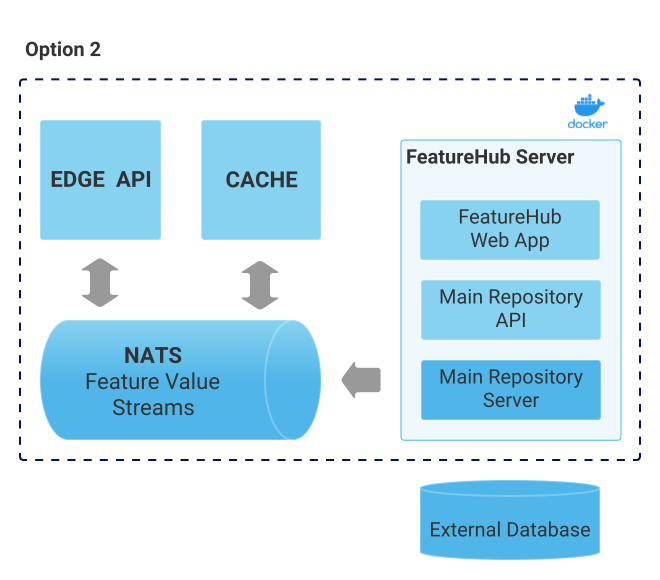

= Installation of FeatureHub
:favicon: favicon.ico
ifdef::env-github,env-browser[:outfilesuffix: .adoc]
:toc: left
:toclevels: 4
:toc-title: Contents
:google-analytics-code: UA-173153929-1

link:index{outfilesuffix}[Back to index]

== Deployment options

There is a GitHub https://github.com/featurehub-io/featurehub-install[repository] where you can find source for all the deployment options.

As explained in the <<architecture.adoc#,Architecture>> section, there are a number of different combinations
for deployment and they typically focus on where you will deploy the infrastructure.

For a streaming deployment, you will need to deploy the full stack and have your own database - this
means a combination of MR, Dacha, Edge, NATS and if you are using it, nginx (which holds the web app).
When combined this is called the *Party Server*. This kind of deployment is more suitable for Kubernetes
or ECS style deploys.  

For a non-streaming deployment, you need to deploy (again with your database) only MR and Edge-Rest. When
these are deployed together they are called *Party Server-_ish_*  

=== Getting started with an evaluation deployment

image::images/fh_deployment_option_1.svg[Option 1,500]
NOTE: the dotted edge represents the container boundary. 

To get you up and going quickly, we have created an evaluation deployment container,
and it contains everything you need to get going with your evaluation, including a 
local (non-scalable, test focused) database. 

To install, grab the latest version of FeatureHub tagged release, e.g.

`curl -L https://github.com/featurehub-io/featurehub-install/archive/refs/tags/featurehub-1.4.1.tar.gz | tar xv`

You can check for the latest versions https://github.com/featurehub-io/featurehub-install/releases[here]

Make sure you have your docker running, and run the following commands from the folder where you saved the FeatureHub executable:

For H2 option:

`cd featurehub-install-featurehub-1.4.1/docker-compose-options/all-in-one-h2`

`docker compose up`

This will install all the necessary components including FeatureHub Admin Console. You can now load it on http://localhost:8085

What makes it only an evaluation option is simply the database used, it writes to the local
disk and is not intended to be used for a long running or concurrent system.

=== Option 1 - Low Volume Deployment (Streaming)

This option is similar to the evaluation, however in this case a _single docker image_ with _all_ FeatureHub components (+ ancillary services), 
talking to the external database. (You can choose from Postgres or MySQL/MariaDB,
we can support other databases, please just ask). This gives you more control over the external database and lets you do single Docker image cloud deployments, however it doesn't scale well for large volume applications as all Edge traffic routes to the same container as your Admin application.

This deployment essentially runs five different services (MR, Dacha, Edge, NATS and nginx) in a single docker container, treating it like a VM rather than a docker-style deploy.

It is possible that excess Edge traffic will cause performance issues with your Admin app as all traffic will be coming into the one instance. If you have relatively low volumes
of traffic (especially given the cache) this may work for you, however streaming traffic is quite resource intense and can swamp a server's available TCP connections. If you 
are deploying your own servers using streaming, your web and/or mobile clients use GET and there aren't too many of them (<10k per second) then you should be ok with this kind of deployment.

You can replicate this image in a cluster by ensuring that the *NATS* configuration is set up correctly (using the
`nats.urls` property or `NATS_URLS` environment variable - see configuration).

NOTE: In the installs folder, there is a `docker compose` setup, and it comes with a sample database along with an initialization script. There is one for Postgres and MySQL.

To install, grab the latest version of FeatureHub tagged release, e.g.

`curl -L https://github.com/featurehub-io/featurehub-install/archive/refs/tags/featurehub-1.4.1.tar.gz | tar xv`

You can check for the latest versions https://github.com/featurehub-io/featurehub-install/releases[here]

Make sure you have your docker running, and run the following commands from the folder where you saved the FeatureHub executable:

For Postgres option:

`cd featurehub-install-featurehub-1.4.1/docker-compose-options/all-in-one-postgres`

`docker compose up`

Or for MySQL option:

`cd featurehub-install-featurehub-1.4.1/docker-compose-options/all-in-one-mysql`

`docker compose up`

This will install all the necessary components including FeatureHub Admin Console. You can now load it on localhost:8085

NOTE: H2 and Postgres are the two databases we test actively with. We are relying on our open source community to test MySQL database and report issues.

=== Option 2 - Scalable Deployment

image::images/fh_deployment_option_3.svg[Option 2,500]

This option is best if you want to run FeatureHub in production at scale. Running separate instances of Edge, Cache, NATS and
FeatureHub Server, means you can deploy these components independently for scalability and redundancy.

In order to scale FeatureHub Server, you need to have first configured a separate database. We provide an installation option for this with Postgres database:

`cd featurehub-install-featurehub-1.4.1/docker-compose-options/all-separate-postgres`

`docker compose up`

There is also a helm chart available for production Kubernetes deployment. Please follow documentation link:https://github.com/featurehub-io/featurehub-install/tree/master/helm[here]

In this deployment, all components (MR, Dacha, NATS, Edge) are split into separate Docker containers, but
`docker compose` runs them all in the same server. This example is intended to show you how you can
split and separate the configuration for each of these pieces.

Because they are deployed in separate containers, you have considerably greater control over what
network traffic gains access to each of these pieces, and they do not all sit under the same Web server. However,
because they run in a single Docker-Compose, they must run on different ports, which means you will need further
configuration to expose them in a normal organisation. This type of deployment is recommended for low volume traffic.

== Configuration

In the https://github.com/featurehub-io/featurehub-install/tree/master/docker-compose-options[deployment options]  configurations you will see that each server has
a set of possible external configurations. If you wish to build and rebundle the images yourself you can easily do this,
the base images, exposed ports and so forth are all configurable as part of the build.

NOTE: As of 1.4.1, all properties that are configured using `properties` files below can also be specified using environment
variables - but use the exact upper case variant. E.g. `db.url` becomes `DB.URL`, `passwordsalt.iterations` becomes
`PASSWORDSALT.ITERATIONS`. If you are running your FeatureHub on AWS ECS you will need to use environment variables
for configuration.

=== Run configuration

By this we mean the properties you can set to control the behaviour of different servers.

==== Management Repository

The following properties can be set:

- `db.url` - the jdbc url of the database server.
- `db.username` -  the username used to log in.
- `db.password` - the password for the user
- `nats.urls` - a comma separated list of NATs servers. If null it simply won't publish.
- `passwordsalt.iterations` (1000) - how many iterations it will use to salt passwords
- `cache.pool-size` (10) - how many threads it will allocate to publishing changes to Dacha and SSE
- `feature-update.listener.enable` (true) - whether this MR should listen to the same topic as the Dacha's and respond if they are empty
-  `environment.production.name` (production) - the name given to the automatically created production environment. It will
be tagged "production".
- `environment.production.desc` (production) - the description field for same.
- `register.url` - the url used for registration. The front-end should strip the prefix off this and add its own relative one. The format has to
be `register.url=http://localhost:8085/register-url?token=%s` - if your site is `https://some.domain.info` for example, it would
be `register.url=https://some.domain.info/register-url?token=%s`
- `portfolio.admin.group.suffix` ("Administrators") - the suffix added to a portfolio group when a portfolio is created
for the first time, it needs an Admin group. So a portfolio called "Marketing" would get an admin group called "Marketing Administrators"
created.

==== Dacha Config

The following properties can be set (that are meaningful):

- `nats.urls` - a comma separated list of NATs servers
- `cache.timeout` - how long the server will attempt to find and resolve a master cache before moving onto the next step (in ms, default = 5000)
- `cache.complete-timeout` - how long it will wait after another cache has negotiated master before it expects to see data (in ms, default = 15000)
- `cache.pool-size` - the number of threads in pool for doing "work" - defaults to 10

==== SSE-Edge Config

- `jersey.cors.headers` - a list of CORS headers that will be allowed, specifically for browser support
- `nats.urls` - a comma separated list of NATs servers
- `update.pool-size` (10) - how many threads to allocate to processing incoming updates from NATs. These are responses to feature
requests and feature updates coming from the server.
- `listen.pool-size` (10) - how many threads to allocate to processing incoming requests to listen. This just takes the request,
decodes it and sends it down via NATs and releases.
- `maxSlots` (30) - how many seconds a client is allowed to listen for before being kicked off. Used to ensure connections
don't go stale.
- `dacha.url.<cache-name>` = url - this is only relevant if you are running split servers - so Dacha and Edge run in their own containers. You
need to tell Edge where Dacha is located. The default cache is called `default, so it will expect one called `dacha.url.default` and the url. In the
sample docker-compose where they are split, the hostname for Dacha is `dacha`, so this is `dacha.url.default=http://localhost:8094`. This isn't
required for the Party Server because communication is internal.

==== Party Server

The party server honours all values set by the Management Repository, Dacha and the SSE-Edge.

==== Common to all servers

All servers expose metrics and health checks. The metrics are for Prometheus and are on `/metrics`,
liveness is on `/health/liveness` and readyness on `/health/readyness`. Each different server has a collection
of what things are important to indicate aliveness. The `server.port` setting will expose these endpoints,
which means they are available to all of your normal API endpoints as well. In a cloud-native environment,
which FeatureHub is aimed at, this is rarely what you want. So FeatureHub has the ability to list these
endpoints on a different port.

- `monitor.port` (undefined) - if not defined, it will expose the metrics and health on the server port.
If not, it will expose them on this port (and not on the server port).

All servers expose quite extensive metrics for Prometheus.

==== Common to Party, SSE Edge and Management Repository

- `server.port` (8903) - the server port that the server runs on. it always listens to 0.0.0.0 (all network interfaces)
- `server.gracePeriodInSeconds` (10) - this is how long the server will wait for connections to finish after it has stopped
listening to incoming traffic

Jersey specific config around logging is from here: https://github.com/ClearPointNZ/connect-java/tree/master/libraries/jersey-common[Connect jersey Common]

- `jersey.exclude`
- `jersey.tracing`
- `jersey.bufferSize` (8k) - how much data of a body to log before chopping off
- `jersey.logging.exclude-body-uris` - urls in which the body should be excluded from the logs
- `jersey.logging.exclude-entirely-uris` - urls in which the entire context should be excluded from the logs. Typically
you will include the /health/liveness and /health/readyness API calls along with the /metrics from this. You may also
wish to include login urls.
- `jersey.logging.verbosity` - the default level of verbosity for logging `HEADERS_ONLY, - PAYLOAD_TEXT, - PAYLOAD_ANY`

== Runtime Monitoring

=== Prometheus

The Prometheus endpoint is on /metrics for each of the servers. It is exposed on the Party and MR Servers by default.

=== Health and Liveness checks

A server is deemed "Alive" once it is in STARTING or STARTED mode. It is deemed "Ready" when it is in STARTED mode. All
servers put themselves into STARTING mode as soon as they are able, and then STARTED once the server is actually
listening. The urls are:

- `/health/liveness`
- `/health/readyness`

== Build

Each of the different options, SSE-Edge, Dacha, the Management Repository and the Party Server build docker images
when called from Maven with a cloud image profile.

Make sure the developer build has been completed with:

----
cd backend && mvn -f pom-first.xml clean install && cd .. &&  mvn -T4C clean install
----

If you wish to do individual builds, which we recommend if you are overriding base images and so forth, cd into
those folders. First you will need to make sure the front end builds - it normally builds and installs as part of the
whole build process. Go into the `admin-frontend` folder and type:

----
mvn -Ddocker-cloud-build=true clean install
----

This is a docker build using a Flutter image of the front-end.

Then jump into your chosen folder and your command is:

----
mvn -Ddocker-cloud-build=true -Dapp.baseimage=docker://featurehub/base_mr:1.7 -Dapp.port=8085 -Dbuild.version=0.0.1 clean package
----

Where the `app.baseimage`, `app.port` and `build.version` are the versions you specify. The `docker://` prefix just means
it will pull it from Docker. It is using `jib` from Google, so you may wish to further play around with those settings.

