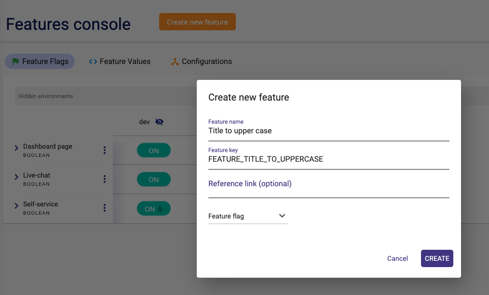

== Description

Backend Todo server app based on Java Jersey to demonstrate the usage of FeatureHub Java Jersey SDK

Demonstrates the Feature Flag ("BOOLEAN" type) usage

Feature key: "FEATURE_TITLE_TO_UPPERCASE"

If "FEATURE_TITLE_TO_UPPERCASE" is enabled - it will convert to-do 'title' property to uppercase for every to-do in the response for add/list/delete/resolve operations.

If this feature is disabled it will have to-do 'title' in whatever format it was sent when a todo was created.

The app is based on the Open API description stored in todo-api folder.

You need to setup a feature of type "Feature flag - boolean" in the FeatureHub Admin Web app.
Use the feature key provided above.

You are required to have a Service Account created in the FeatureHub Web app with the "read" permissions for your desired environment.
Once this is set, copy the SDK URL for your desired environment and set it in the properties file located here:

`$HOME/.featurehub/example-java.properties`

Include the following lines and substitute with your own keys:
`feature-service.url=http://your-featurehub-url:8903/features/default/99d8bca3-4e10-4c58-a10c-509b31db3532/X8y3nRMTgtVS7Lsn8Oyk1ppT2Yeap7XGnKVZEjVDMd1XdeqtBAjE6BH4F6f91jXkdh2Sf2zk6PzHJSPa

feature-service.google-analytics-key=UA-1XXXXXXX-1

feature-service.cid=1234-5678-abcd-abcd`

Note, the "your-featurehub-url" and port will depend on which server you are running.
If you are running SSE by itself, or the Docker with "all-separate-postgres" it will default to 8553. If you are running Party Server, it will be 8903, if you are running Docker with All-In-One-h2 it will be 8085

You will require to have valid GA Tracking ID (to be able to see events coming through in GA), e.g. 'UA-XXXXXXXXX-X'.

GA events:

`name: "todo-add", value: "10"`

`name: "todo-delete", value: "5"`

Once you launch the server, any call to "add" or "delete" to-do item will generate a GA event accordingly.

Note: You can view the events appear in the real-time console in GA. The events will also appear in "Behaviour" section with ~12 hours delay.

More on GA integration can be found here https://docs.featurehub.io/#_google_analytics_integration

== Running the sample

We expect people who are editing the `example-java.properties` file to be doing so from their IDE, in which case please
run the AppRunner in the tests. This allows us to bring in extra dependencies that are not compiled into the final application.

== Installation Instructions

`mvn clean generate-sources`

run the app using runner file: `todo-backend-java/src/test/java/todo/backend/AppRunner.java`

once the app is running, you should be able to do:

[source]
----
curl -X POST \
  http://0.0.0.0:8099/todo/add \
  -H 'Content-Type: application/json' \
  -d '{"title": "Hello World", "id": "456"}'
----

and to get the list of to-dos:

[source]
----
curl -X GET \
http://0.0.0.0:8099/todo/list \
-H 'Postman-Token: 6bfe318a-5481-4e8e-a3e4-ab881202ba31' \
-H 'cache-control: no-cache'
----

Watch how "title" value in the response changes from lower case to upper case when you turn feature on/off from the admin console 

== Feature Value Interceptors

Both types are loaded - from system properties and from OpenTracing. If you wish to override a feature using system
properties for example, add extra values to your ``example-java.properties`:

----
feature-toggles.allow-override=true
feature-toggles.FEATURE_TITLE_TO_UPPERCASE=true
----

this will force the title to be upper case.

If you are using OpenTracing (and it is enabled in this sample app), then you can further specify in your properties file:

----
featurehub.opentracing-enabled=true
----

If you then hit your server with: 

----
curl -v -H "jaeger-debug-id: 11" -H "uberctx-fhub.FEATURE_TITLE_TO_UPPERCASE: true" -H 'content-type: application/json' http://localhost:8099/todo/list
----

it will show titles in upper case (unless you have locked this feature). It will do this even if this feature does
not exist on your server (i.e. you haven't set it up yet).

