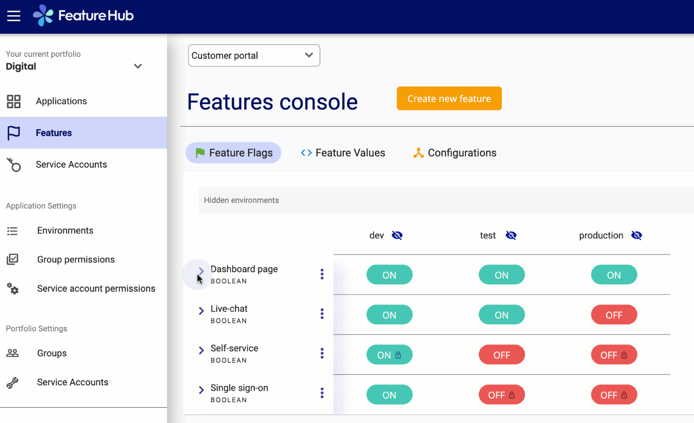
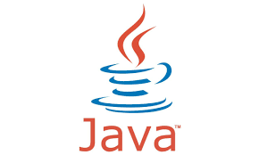
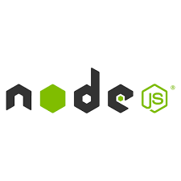

image::docs/images/fh_primary_navy.png[Feature Hub,500]

FeatureHub is a platform to help software teams to orchestrate releases of their features, from feature flags to A/B experiments and remote or centralised configuration management.

FeatureHub can be used with small startups through to large enterprises with many applications and teams.
It has an enterprise grade permission model, that is intuitive and easy to use, so you can be up and running quickly.

https://demo.featurehub.io[Try FeatureHub demo now]

== Why FeatureHub?

=== Free

* Unlimited users
* Unlimited features
* Unlimited clients requesting features
* Unlimited Applications and Environments
* Unlimited scalability
* Choice of how to run your experiment - feature flag, number, string or remote configuration
* Integration with analytics so you can see how your experiments perform, with Google Analytics out of the box

=== Supported SDKs

  : : : :
  : : : :
image:docs/images/javascript-logo.png[Javscript Logo,50] : : : :
image:docs/images/react-logo.png[React Logo,100]: : : :
image:docs/images/go-logo.png[Go Logo,100]: : :  :

=== Easy to use

* Control features from an easy to use console
* View how your features are setup across each environment from the main console
* Environments promotion order - to help you see and order features by environment
* With "smart lock" only enable feature state updates when they are ready
* Use handy admin functions, like applications, environments and user management

=== Enterprise ready

* Run on your own infrastructure (self-hosted)
* Access control levels to allow different teams/groups permissions.
* Multiple portfolios (department) support

=== Best development experience

* Easy setup, Cloud Native - docker containers available
* Variety of SDK's support for Web and API: Java, Node, Golang, Dart
* Easy to integrate with test automation - API to control feature states from the tests is available
* Support for feature flags, numbers, strings and Json structure (remote configuration)
* Easy to log events with analytics with attached feature state
* Documentation and tutorials available

//Building software with feature management encourages DevOps practices like
//http://trunkbaseddevelopment.com[trunk based development], continuous delivery and importantly,
//separating deployment from releasing. Enabling teams to deliver value to customers early and often,
//whilst maintaining high quality and keeping risk low.
//
//image::docs/images/fh_learn_build_measure.svg[FeatureHub Feedback Loop,800]

== Documentation

Full documentation can be found at https://docs.featurehub.io[docs.featurehub.io]

=== Getting started

Out of the box FeatureHub uses Docker, to start simply run the following docker command

[source]
----
docker-compose up
----

[NOTE]
You'll need to https://docs.docker.com/get-docker/[install Docker] first.

Once running, open up a browser and head to http://localhost:5000 there you can kick off the initial setup.

There are several deployment options depending on your use case, we strongly recommend reading about these options in the https://docs.featurehub.io[documentation].

For advanced users who want to run the stack from scratch, please see the <<docs/developers.adoc, developer docs>> for more details.

=== Examples 

We have several SDK examples for Java, Node JS, Typescript and React implementations.

- link:examples/README.adoc[Examples documentation]

- link:examples/[Examples]

//== Built with
//* https://flutter.dev/web[Flutter Web]
//* https://openjdk.java.net/projects/jdk/11/[Java 11]
//* https://dart.dev/[Dart]
//* https://nats.io[NATS]
//* https://search.maven.org/search?q=a:openapi-dart-generator[Open API Dart Generator]

== Coming soon

* Gradual rollout and A/B testing
* SDK's : C#/.NET, Mobile (Swift, Java), Python
* Per request feature testing with CNCF Open Tracing and Open Telemetry
* Yaml remote configuration support
* Feature auditing

== Contributing

FeatureHub is an open source project, and we love to receive contributions from our community!
There are many ways to contribute, from writing tutorials or blog posts, improving the documentation, submitting bug reports and feature requests or writing code which can be incorporated into FeatureHub itself.

Read link:.github/CONTRIBUTING.md[contributing guide here].

We expect everyone contributing or participating in discussions in FeatureHub GitHub or any of it's sub-projects' codebases, issue trackers or chats to follow the FeatureHub
link:.github/CODE_OF_CONDUCT.md[code of conduct].

== Where to get help? 

If you cannot find an answer in our documentation please email our community supporters at info@featurehub.io

== License

FeatureHub is operating under Apache 2.0 license.
Please refer to the full license link:LICENSE.txt[here]. 

