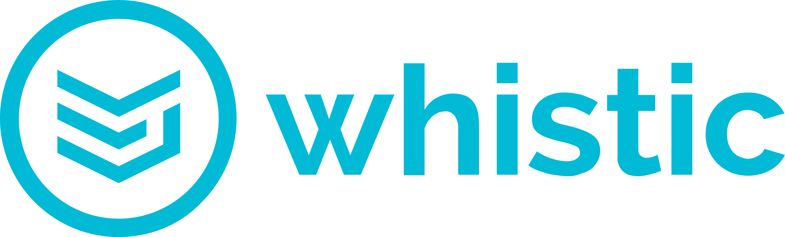

[link=https://github.com/featurehub-io/featurehub/actions/workflows/codeql-analysis-java.yml]
image::https://github.com/featurehub-io/featurehub/actions/workflows/codeql-analysis-java.yml/badge.svg[Build backend]


:icons: font
image::docs/images/fh_primary_navy.png[Feature Hub,500]

FeatureHub is a Cloud Native platform to help software teams manage their features, from feature flags (also known as feature toggles) to A/B experiments and remote or centralised configuration.
This is the primary source code repository for FeatureHub.

https://demo.featurehub.io[Try FeatureHub demo now]

**Install with Docker (evaluation mode) **

```
$ docker run -p 8085:8085 --user 999:999 -v $HOME/party:/db featurehub/party-server:latest
```

Once installed, head to http://localhost:8085 to see FeatureHub Admin Console in action

image::docs/images/fh-features-console-dark.png[FeatureHub console demo,800]

== FeatureHub Users

  


== Are you also using FeatureHub?

We are looking for companies that have successfully adopted FeatureHub to help us understand our customer base. Feel free to let us know by adding your company logo above (please raise a PR or contact us through our website).


== Why FeatureHub?

=== Free

* Unlimited users
* Unlimited features
* Unlimited clients requesting features
* Unlimited Applications and Environments
* Unlimited scalability


=== Feature flags, A/B testing, experimentation and analytics support
* Choice of how to run your experiment - feature flag, number, string or remote configuration
* Split targeting strategies support: percentage rollout, targeting by country, device, platform, version or any custom attribute specific to your application.
* Integration with analytics so you can see how your experiments perform, with Google Analytics support out of the box


=== Easy to use

* Control features from an easy to use console
* View how your features are setup across each environment from the main console
* Environments promotion order - to help you see and order features by environment
* With "smart lock" only enable feature state updates when they are ready
* Use handy admin functions, like applications, environments and user management

=== Enterprise ready

* Run on your own infrastructure (self-hosted)
* SSO login support - Google, Microsoft, GitHub, Keycloak
* Access control levels to allow different teams/groups permissions.
* Multiple portfolios (department) support

=== Best development experience

* Easy to set up, Cloud Native - docker containers available
* Easy to integrate with test automation - API to control feature states from the tests is available
* Support for feature flags, numbers, strings and Json structure (remote configuration)
* Easy to log events with analytics with attached feature state
* Documentation and tutorials available

=== Supported SDKs

image:https://docs.featurehub.io//images/languages.png[Featurehub SDK Languages,1000]

https://docs.featurehub.io/#_sdk_usage[SDKs documentation and examples table]

https://docs.featurehub.io/#_sdk_capabilities_overview[SDKs capabilities table]


== Documentation

Full documentation can be found at https://docs.featurehub.io[docs.featurehub.io]

=== Getting started

If you are just curious to see how FeatureHub works and would like to play with it there is a simple way of doing it,
please follow instructions https://docs.featurehub.io/#_starting_small[here].

Once you have decided to start using FeatureHub in your team, there are also several installation options
depending on your use case, please read about these options https://docs.featurehub.io/#_installation[here].

Note: We have a separate https://github.com/featurehub-io/featurehub-install[install repository] with configured docker images

We selectively take cuts of the main repository and build them into docker image sets. We then
update install repository with the latest images and issue tags on that repository.

== Coming soon

* Feature auditing
* SDK's : Python, Ruby
* Yaml remote configuration support

For more details please refer to https://github.com/featurehub-io/featurehub/issues?q=is%3Aissue+is%3Aopen+label%3Aroadmap[Roadmap tickets]


== Contributing

FeatureHub is an open source project, and we love to receive contributions from our community!
There are many ways to contribute, from writing tutorials or blog posts, improving the documentation, submitting bug reports and feature requests or writing code which can be incorporated into FeatureHub itself.


=== Further information for contributors

If you have reviewed the https://docs.featurehub.io/architecture.html[Architecture section] of the FeatureHub
documentation you will notice there are several components. FeatureHub is designed this way to allow
to scale from a single application option to large organisations serving billions
of requests for features per day.

==== The Backend Servers

The Management Repository, Dacha (the Cache layer) and Edge (where all clients connect
via their service accounts) are all written in _Java_. This allows us to build fully scalable
software. In our simple examples, it all deploys together in one simple
bundle. In complex examples it can all be sliced apart, sharded and massively scaled. Apart from Java, we use a few other technologies as well which will
help OpenAPI, JAX-RS (specifically Jersey), Maven (specifically with Maven Tiles), and Ebean for our ORM.

Java was also chosen amongst the JVM stack because of its ability to allow the greatest number of people to
contribute. The `pom.xml`  in the main repository to allow for easy loading and local installation
of the project. It is called a _reactor_.

If you want to go more advanced, we also support Prometheus, Health Checks, OpenTracing and Jaeger.

==== The FeatureHub Admin Console

The Admin front end is written in Flutter Web. This choice gives us a wide range
of platforms (Web, mobile, native platforms) we can target from the same codebase. Currently, Web platform is our priority. If you want
to contribute to the Admin Console - we would love you to join us!

==== The SDKs

If you are planning on helping us by building an SDK in a language we don't yet support, please refer to this https://docs.featurehub.io/sdks-development.html[documentation]. We are happy to get contributions that slowly add full
functionality for a new language.

== Where to get help?

If you cannot find an answer in our documentation please join our Slack community link:https://join.slack.com/t/anyways-labs/shared_invite/zt-frxdx34x-ODs_XmLh6BCvqiNeBRx0hA[Anyways Labs]

You can also start a discussion in GitHub Discussions link:https://github.com/featurehub-io/featurehub/discussions[here]

Or email our community supporters at info@featurehub.io

== License

FeatureHub is operating under Apache 2.0 license.
Please refer to the full license link:https://github.com/featurehub-io/featurehub/blob/master/LICENSE.txt[here].


