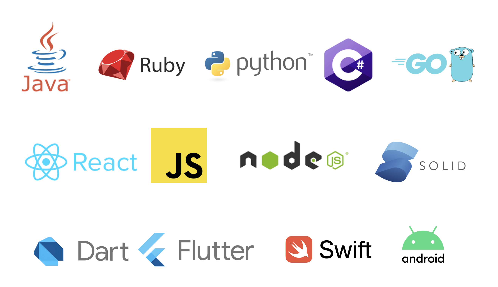

[link=https://github.com/featurehub-io/featurehub/actions/workflows/codeql-analysis-java.yml]
image::https://github.com/featurehub-io/featurehub/actions/workflows/codeql-analysis-java.yml/badge.svg[Build backend]


:icons: font
image::docs/modules/ROOT/images/fh_primary_navy.png[Feature Hub,500]

FeatureHub is a Cloud Native platform to help software teams manage their features, from feature flags (also known as feature toggles) to A/B experiments and remote or centralised configuration.

FeatureHub is available as a self-hosted Open Source service and as a cloud based SaaS service.

This is the primary source code repository for FeatureHub Open Source.

*FeatureHub SaaS - join hosted cloud service*

FeatureHub service is now available as a SaaS offering. You can join today https://app.featurehub.io/[here]. No credit card required and a 30-day free trial is available.

Documentation specific to SaaS service can be found https://docs.featurehub.io/featurehub/latest/hosted/index.html[here]


*FeatureHub Open Source - Install with Docker (evaluation mode)*

```
$ docker run -p 8085:8085 --user 999:999 -v $HOME/party:/db featurehub/party-server:latest
```

Once installed, head to http://localhost:8085 to see FeatureHub Admin Console in action


**Connect to FeatureHub in your app via SDK**

1. Create an application, an environment and a feature from the Admin Console

2. Create and copy the API Key (client or server eval) from the Admin Console on the API Keys page.

3. Create FeatureHub config and start using feature flags in your app (see Typescript example below). For more SDKs and examples please see https://docs.featurehub.io/featurehub/latest/sdks.html#_sdk_usage[here]

```typescript
import {
  EdgeFeatureHubConfig,
} from 'featurehub-javascript-client-sdk';

const edgeUrl = 'http://localhost:8085/'; // for SaaS version, replace with edge URL provided in the API Keys page
const apiKey = 'default/3f7a1a34-642b-4054-a82f-1ca2d14633ed/aH0l9TDXzauYq6rKQzVUPwbzmzGRqe*oPqyYqhUlVC50RxAzSmx';

const fhConfig = new EdgeFeatureHubConfig(edgeUrl, apiKey);

fhConfig.init();
const fhClient = await fhConfig.newContext().build();
if(fhClient.getFlag('FEATURE_KEY')) {
  // do something
}
else {
  //do something else
}

```

== FeatureHub API

https://docs.featurehub.io/featurehub/latest/api-definition.html[Headless API] is available to manage FeatureHub app if you require automation or prefer not to use Admin Console to manage features. API is provided in https://github.com/featurehub-io/featurehub/tree/main/infra/api-bucket/files/mrapi[OpenAPI format] and can be imported into Postman or similar tools. Follow https://docs.featurehub.io/featurehub/latest/admin-service-accounts.html[this documentation] to generate access tokens.

https://docs.featurehub.io/featurehub/latest/sdk-api-definition.html[SDK API] is also available. This is an API that is used to retrieve feature states in various SDKs that we provide. Open API file can be located https://github.com/featurehub-io/featurehub/tree/main/infra/api-bucket/files/edge[here]

== FeatureHub Users

image:docs/images/Whistic_Logo.png[link="https://www.whistic.com/",300]    image:docs/images/Ruby_NewLogo_Vertical.png[link="https://www.rubyplaynet.com/", 150] image:docs/images/lovebonito_logo.png[link="https://www.lovebonito.com/",200]


== Are you also using FeatureHub?

We are looking for companies that have successfully adopted FeatureHub to help us understand our customer base. Feel free to let us know by adding your company logo above (please raise a PR or contact us through our website).


== Why FeatureHub?

=== Free Open Source version available

* Unlimited users
* Unlimited features
* Unlimited clients requesting features
* Unlimited Applications and Environments
* Unlimited scalability. FeatureHub is the only open source and cloud native platform that can scale for large enterprises needs


=== Feature flags, A/B testing, experimentation and analytics support
* Choice of how to run your experiment - feature flag, number, string or remote configuration
* Split targeting strategies support: percentage rollout, targeting by country, device, platform, version or any custom attribute specific to your application.
* Integration with analytics so you can see how your experiments perform, with Google Analytics support out of the box


=== Easy to use

* Control features from an easy-to-use console or headless API
* View how your features are setup across each environment from the main console
* Environments promotion order - to help you see and order features by environment
* With "smart lock" only enable feature state updates when they are ready
* Use handy admin functions, like applications, environments and user management

=== Enterprise ready

* Run on your own infrastructure (self-hosted) or use SaaS option
* External auth support - login with Google, Microsoft, GitHub, Keycloak
* Access control levels to allow different teams/groups permissions.
* Multiple portfolios (department) support

=== Best development experience

* Easy to set up, Cloud Native - docker containers and full Kubernetes ready helm chart available
* Use FeatureHub API
* Easy to integrate with test automation - API to control feature states from the tests is available
* Support for feature flags, numbers, strings and Json structure (remote configuration)
* Easy to log events with analytics with attached feature state
* Documentation and tutorials available

=== Supported SDKs



https://docs.featurehub.io/featurehub/latest/sdks.html#_sdk_usage[SDKs documentation and examples table]

https://docs.featurehub.io/featurehub/latest/sdks.html#_sdk_capabilities_overview[SDKs capabilities table]


== Documentation

Full documentation can be found at https://docs.featurehub.io[docs.featurehub.io]

=== Getting started

If you are just curious to see how FeatureHub works and would like to play with it there is a simple way of doing it,
please follow instructions https://docs.featurehub.io/featurehub/latest/index.html#_evaluating_featurehub[here].

Alternatively, you can join FeatureHub SaaS https://app.featurehub.io/[here] and experiment while on free trial.

Once you have decided to start using FeatureHub Open Source in your team, there are also several installation options
depending on your use case, please read about these options https://docs.featurehub.io/featurehub/latest/installation.html[here].

Note: We have a separate https://github.com/featurehub-io/featurehub-install[install repository] with configured docker images

We selectively take cuts of the main repository and build them into docker image sets. We then
update install repository with the latest images and issue tags on that repository.

== Roadmap

FeatureHub roadmap can be found https://github.com/orgs/featurehub-io/projects/3[here]


== Contributing

FeatureHub is an open source project, and we love to receive contributions from our community!
There are many ways to contribute, from writing tutorials or blog posts, improving the documentation, submitting bug reports and feature requests or writing code which can be incorporated into FeatureHub itself.


=== Further information for contributors

If you have reviewed the https://docs.featurehub.io/featurehub/latest/architecture.html[Architecture section] of the FeatureHub
documentation you will notice there are several components. FeatureHub is designed this way to allow
to scale from a single application option to large organisations serving billions
of requests for features per day.


== Where to get help?

If you cannot find an answer in our documentation please join our Slack community link:https://join.slack.com/t/anyways-labs/shared_invite/zt-frxdx34x-ODs_XmLh6BCvqiNeBRx0hA[Anyways Labs]

You can also start a discussion in GitHub Discussions link:https://github.com/featurehub-io/featurehub/discussions[here]

Or email our community supporters at info@featurehub.io

== License

FeatureHub is operating under Apache 2.0 license.
Please refer to the full license link:https://github.com/featurehub-io/featurehub/blob/master/LICENSE.txt[here].


