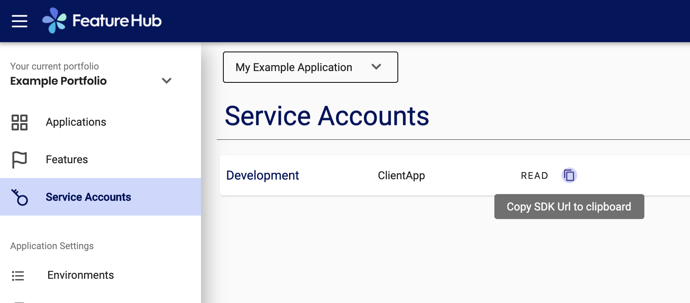

# Javascript/Typescript Client SDK for FeatureHub

Welcome to the Javascript/Typescript SDK implementation for FeatureHub. It is the supported version, but it does not mean
you cannot write your own, please follow [Contributing](https://github.com/featurehub-io/featurehub/blob/master/.github/CONTRIBUTING.adoc)
guidelines.

## Overview

Below explains how you can use the FeatureHub SDK in Javascript or Typescript for applications like Node.js
backend server or Web front-end (e.g. React). 

This repository includes the Server Sent Events realtime update SDK for Javascript and Typescript.

When you install the SDK it will also install the dependency [featurehub-repository](https://www.npmjs.com/package/featurehub-repository)
which is a core library that holds features and creates events. 

It is designed this way, so we can separate core functionality and add different implementations in the future, similar to EventSource.   

See [FeatureHub.io](https://featurehub.io) for more details. There you can find a link to try our demo version of FeatureHub Web Console. 
If you like you can experiment with this SDK in your code and play with the feature flags and control them from the FeatureHub Web Console.
You can use one of the service accounts SDK Url to substitute ```<sdk_url>``` in below examples.

## Installation Instructions

Run the following command: 

`npm install featurehub-eventsource-sdk`

## Service account SDK Url

Find and copy your SDK Url from the FeatureHub Web Console (you can find it also in the Demo version) - 
you will use this in your code to configure feature updates for your environments. 
It should look similar to this: ```https://vrtfs.demo.featurehub.io/features/default/71ed3c04-122b-4312-9ea8-06b2b8d6ceac/fsTmCrcZZoGyl56kPHxfKAkbHrJ7xZMKO3dlBiab5IqUXjgKvqpjxYdI8zdXiJqYCpv92Jrki0jY5taE```

 

## Recipes

We include these up front because its likely you want to just get up and started. 

### A simple nodejs server

To startup with a simple nodejs server with FeatureHub you are likely to do this. This is taken
from our sample `todo-backend-typescript` client.

```typescript
import { FeatureHubEventSourceClient } from 'featurehub-eventsource-sdk/dist';
import {FeatureContext, featureHubRepository, GoogleAnalyticsCollector, Readyness} from 'featurehub-repository/dist';

// find the full url for your FeatureHub environment and start listening to it in realtime mode                                   
const featureHubEventSourceClient  = new FeatureHubEventSourceClient(process.env.FEATUREHUB_APP_ENV_URL);
featureHubEventSourceClient.init();

// .. do some initialization

// .. now you are ready, tell the featurehub repository to let you know when the features
// are ready so you can start listening for traffic

featureHubRepository.addReadynessListener((ready) => {
  if (ready == Readyness.Ready) {
    console.log("Features are available, starting server...");

    api.listen(port, function () {
      console.log('server is listening on port', port);
    });
  }
});
```

### A simple browser based client

In this case, you are again using the event source method of connecting, but you will probably want to use _catch
and release_ mode, which is described below. This is again taken from the `todo-frontend-react-typescript` example.


```typescript 
import {
  FeatureContext,
  featureHubRepository,
  // GoogleAnalyticsCollector,
  Readyness,
  FeatureUpdater,
  FeatureHubPollingClient
} from 'featurehub-repository/dist';
import { FeatureHubEventSourceClient } from 'featurehub-eventsource-sdk/dist';
import globalAxios from 'axios';

// some class that defines what your config json file will look like
class ConfigData {
  sdkUrl: string;
  baseUrl: string;
}

async initializeFeatureHub() {
    featureHubRepository.addReadynessListener((readyness) => {
      if (readyness === Readyness.Ready) {
         // maybe take loading screen off...
      }
    });

    featureHubRepository
      .addPostLoadNewFeatureStateAvailableListener((_) =>
        { // update the UI, or tell user it needs to happen });
                                                     
    // prevent updates to features until we say so
    featureHubRepository.catchAndReleaseMode = true;
               
    // indicate some information about the user and client so we can get the right 
    // rollout strategies applied to our features
    featureHubRepository.clientContext.userKey('ideally-unique-id')
      .country(StrategyAttributeCountryName.NewZealand)
      .device(StrategyAttributeDeviceName.Browser)
      .build(); 

    // load the config from the config json file
    const config = (await globalAxios.request({url: 'featurehub-config.json'})).data as ConfigData;

    // listen for features from the url from the json you just loaded above
    this.eventSource = new FeatureHubEventSourceClient(config.sdkUrl);
    this.eventSource.init();

    // this lets you add callback listeners for features. If when you "release" below and this changes, you will
    // get a callback event
    // featureHubRepository.getFeatureState('SUBMIT_COLOR_BUTTON').addListener((fs: FeatureStateHolder) => {
    //   // do something with changed colour
    // });
    
    // add an analytics adapter with a random or known CID
    // featureHubRepository.addAnalyticCollector(new GoogleAnalyticsCollector('UA-1234', '1234-5678-abcd-1234'));
  }

// somewhere else in the code, depending on say navigation or a pull to refresh event
featureHubRepository.release();
``` 

### A Mobile device

On a mobile device you will swap out the code above:

```typescript
    // listen for features from the url from the json you just loaded above
    this.eventSource = new FeatureHubEventSourceClient(config.sdkUrl);
    this.eventSource.init();
```

with the following:

```typescript
const fp = new FeatureHubPollingClient(
  featureHubRepository, // repository 
  config.baseUrl,  // host
  300000,    // every 300 seconds, 0 if only fire once
  [config.sdkUrl] 
);

fp.start();
```

This will change to a GET request that triggers every five minutes or so. 
 

## The FeatureHub repository

### Overview

The FeatureHub repository is a single class that holds and tracks features in your system. It gets features delivered
to it to process, tracks changes, and allows you to find and act on features in a useful way. 
It also sends events out in certain circumstances.

### Creating the FeatureHub repository

Although one exists and is exported for your use (`featureHubRepository`), you can create others if you wish. The class is simply 
`new ClientFeatureRepository()`. 

### Using the FeatureHub repository

There are two ways to use this repository - an imperative way and an event driven way. You can use the two together,
or just one. 

#### Imperative requests

This is when you ask the repository for a specific feature and for its state. Something like:

```typescript
if (featureHubRepository.feature('FEATURE_X').getBoolean()) {
  // do something
}
``` 

#### Event driven feature updates

This is when, if the feature changes (either from nothing to something, which happens when we first get the features,
or an update comes through), a callback is made into your provided function. You can have as many of these listeners 
as you like.

This would look something like:

```typescript
featureHubRepository.feature('FEATURE_X').addListener((fs: FeatureStateHolder) => {
  console.log(fs.getKey(), 'is', fs.getBoolean());
});
```

### Meta-Events from the repository

There are two "meta events" from the FeatureHub repository, readyness and "new feature available". 

#### Readyness 

Readyness is triggered when your repository first receives a list of features or it fails on a subsequent update. In a
UI application this would indicate that you had all the state necessary to show the application. In a nodejs server,
this would indicate when you could start serving requests.

````typescript
featureHubRepository.addReadynessListener((readyness) => {
  if (readyness === Readyness.Ready) {
       console.log("Features are available, starting server...");
   
       api.listen(port, function () {
         console.log('server is listening on port', port);
       })
  }
});
````

#### New Feature State Available 

The repository tracks features and their states by version number. When a new version of a feature state arrives,
say a flag changes from off to on, then the repository will check this version is really newer, and if so, it will
(in the default, immediate mode) apply that change to the current feature state it is holding. From this it will
trigger any events on that particular feature, and it can also trigger a generic event - 
`postLoadNewFeatureStateAvailable`. This event gets triggered once no matter if a bundle of changes comes in, or a 
single change comes in. 

You would typically use this to know if events have occurred that mean you need to go back and get event states or
rerender a page or similar.

This event gets a little more complicated when using the second (non default) mode - _catch and release_ - discussed
in more detail with examples below. In this mode, the repository will receive the updates, and compare them, but it
will *not* apply them to the features in the repository. As such, in this mode, a change on the server that 
turns up in the repository (via GET or EventSource) will *not* be applied to the local feature state, it will be held.
And the effect of this is that this event will _not_ fire. When you tell the repository to process these "held" 
changes, then the event will fire. 

Attaching a listener for this hook is done like this:

```typescript
featureHubRepository
  .addPostLoadNewFeatureStateAvailableListener((_) => {
    // e.g. tell user to page is going to update and re-render page
});  
```

## Updating your repository

### Real-time updates

In this mode, you will make a connection to the FeatureHub Edge server using the EventSource library, and any updates 
to any events will come through to you in near realtime, automatically updating the feature values in the repository. 

```javascript 
//paste your Service Account SDK URL here

this.eventSource = new FeatureHubEventSourceClient('[host]/features/<sdkUrl>'); 
this.eventSource.init();
```

Your host will depend on where the SSE Edge is. For example, when running inside the basic Docker examples it is
at http://localhost:8050/. 

In any situation where a continual connection to the Internet is fine, or when you don't want fine controlled updates
of features (i.e. you want updates immediately), this is your ideal choice. All server side applications and most
Web applications will use this choice of connection. 

### GET-based updates

In this mode, you make a GET request, which you can choose to either do once, when specific things happen in your application,
(such as navigation change) or on a regular basis (say every 5 minutes) and the changes will be passed into the 
FeatureHub repository for processing. 

```typescript
const fp = new FeatureHubPollingClient(
  featureHubRepository, // repository 
  'http://localhost:8553',  // host
  10000,    // every 10 seconds, 0 if only fire once
  ['default/ce6b5f90-2a8a-4b29-b10f-7f1c98d878fe/VNftuX5LV6PoazPZsEEIBujM4OBqA1Iv9f9cBGho2LJylvxXMXKGxwD14xt2d7Ma3GHTsdsSO8DTvAYF'] 
);

fp.start(); 
``` 

There are a few things to note:

- you only need to specify the host, not the full URL (including `/feature`)
- you can request the features for multiple environments
- you can specify a poll interval (in milliseconds). If 0 then it fires only once (immediately) and stops.

It will automatically update the repository.

## Reacting to feature changes

Unlike the server focused APIs, Typescript/Javascript, like Dart (for Flutter) has two modes of operation.

### Immediate reaction (recommended for servers)

In this mode, as changes occur to features coming from the server, the states of the features will immediately change.
Events are fired. This kind of operation is normally best for servers, as they want to react to what has been asked for.

You do not have to write any code to get this mode. It is the default.

### Catch and Release (recommended for Web and Mobile)

This is a deliberate holding onto the updates to features until such a time as they are "released". This is separate
from them coming down from the source and being put in the repository. In _catch and release_ mode, the repository will
hold onto the changes (only the latest ones) and apply them when you chose to "release them". This means there will be
no delay while making a GET request for the latest features for example when you wish to "check" for new updates to 
features when shifting pages or similar.

This strategy is recommended for Web and Mobile applications as controlled visibility for the user is important.  

```javascript
// don't allow feature updates to come through
featureHubRepository.catchAndReleaseMode = true; 
```

If you choose to not have listeners, when you call: 

```javascript
featureHubRepository.release();
```

then you should follow it with code to update your UI with the appropriate changes in features. You
won't know which ones changed, but this can be a more efficient state update than using the listeners above.

## Failure

If for some reason the connection to the FeatureHub server fails - either initially or for some reason during
the process, you will get a readyness state callback to indicate that it has now failed.

```javascript
export enum Readyness {
  NotReady = 'NotReady',
  Ready = 'Ready',
  Failed = 'Failed'
}
```
## Rollout Strategies

FeatureHub at its core now supports _server side_ evaluation of complex rollout strategies, both custom ones
that are applied to individual feature values in a specific environment and shared ones across multiple environments
in an application. Exposing that level fo configurability via a UI is going to take some time to get right,
so rather than block until it is done, Milestone 1.0's goal is to expose the percentage based rollout functionality
for you to start using straight away.

Future Milestones will expose more of the functionality via the UI and will support client side evaluation of
strategies as this scales better when you have 10000+ consumers. For more details on how
experiments work with Rollout Strategies, see the [core documentation](https://docs.featurehub.io).

#### Coding for Rollout strategies 
To provide this ability for the strategy engine to know how to apply the strategies, you need to provide it
information. There are five things we track specifically: user key, session key, country, device and platform and
over time will be able to provide more intelligence over, but you can attach anything you like, both individual
attributes and arrays of attributes. 

Remember, as of Milestone 1.0 we only support percentage based strategies,
so only UserKey is required to support this. We do however recommend you adding in as much information as you have
so you don't have to change it in the future. 

```typescript
    featureHubRepository.clientContext.userKey('ideally-unique-id')
      .country(StrategyAttributeCountryName.NewZealand)
      .device(StrategyAttributeDeviceName.Browser)
      .build(); 
```

The `build()` method will trigger the regeneration of a special header (`x-featurehub`) or parameter (nodejs
it is a header, the browser needs a parameter as the SSE spec doesn't allow for extra headers). This in turn
will automatically retrigger a refresh of your events if you have already connected (unless you are using polling
and your polling interval is set to 0).

To add a generic key/value pair, use `attribute_value(key, value)`, to use an array of values there is 
`attribute_values(key, Array<value>)`. You can also `clear()`.

In all cases, you need to call `build()` to re-trigger passing of the new attributes to the server for recalculation.

By default, the _user key_ is used for percentage based calculations, and without it, you cannot participate in
percentage based Rollout Strategies ("experiments"). However, a more advanced feature does let you specify other
attributes (e.g. _company_, or _store_) that would allow you to specify your experiment on..

## Analytics

Allows you to connect your application and see your features performing in Google Analytics.

When you log an event on the repository,
it will capture the value of all of the feature flags and featutre values (in case they change),
and log that event against your Google Analytics, once for each feature. This allows you to
slice and dice your events by state each of the features were in. We send them as a batch, so it
is only one request.

There are two different implementations, one for when you are in the browser and one for when you
are in the server, like nodejs. You don't need to worry about this, the code detects which one it is in and 
creates the correct instance. 

There is a plan to support other Analytics tools in the future. The only one we
currently support is Google Analytics, so you need:

- a Google analytics key - usually in the form `UA-123456`. You must provide this up front.
- a CID - a customer id this is associate with this. You can provide this up front or you can
provide it with each call, or you can set it later. 

1) You can set it in the constructor:

```typescript
const collector = new GoogleAnalyticsCollector('UA-123456', 'some-CID');
```

2) You can tell the collector later.

```typescript
const collector = new GoogleAnalyticsCollector('UA-123456');
collector.cid = 'some-value'; // you can set it here
```

3) When you log an event, you can pass it in the map:

```typescript
const data = new Map<string, string>();
data.set('cid', 'some-cid');

featureHubRepository.logAnalyticsEvent('event-name', other: data);
```

4) For a NODE server, you can set as an environment variable named `GA_CID`.

```typescript
featureHubRepository.addAnalyticCollector(collector);
```

As you can see from above (in option 3), to log an event, you simply tell the repository to
log an analytics event. It will take care of bundling everything up, passing it off to the
Google Analytics collector which will post it off.

Read more on how to interpret events in Google Analytics [here](https://docs.featurehub.io/analytics.html)

## Feature consistency between client and server

There are a number of use cases where it makes sense that the features the client sees should be the same
as the features that the server sees. In any environment however where both the server and client are pulling (or
getting pushed) their features from the FeatureHub servers, both should update at the same time. 

With the _Catch and Release_ functionality however, the client may choose to stash those incoming changes and not 
apply them, but the _server will not know this_. We need a method of allowing the client to tell the server
what features it is using so it knows which ones to apply. This actually becomes more interesting when you consider
server to server communication down the line as well, where you ideally wish to pass the feature state through
http and event-streaming layers if possible. 

The second use case is when doing any kind of testing, being able to indicate on each request in a Mocha / Jest / Cucumber
test that a feature is in a particular state lets you _parallelize_ your testing. If you have to set the entire
environment to a particular state, you can only run tests that expect those features in those states and you can very
quickly get sufficiently complex in your feature set that testing becomes a nightmare.

There is an important caveat to this. You can only send features that exist and _are not locked_. Locked features 
cannot be overridden. The reason for this is that in "catch and release" mode, you may wish to keep overriding features
available even in your production application. However, this could lead to hackers trying to turn on un-ready features
so forcing features to be locked and false is an important security safeguard.

### W3C Baggage Standard

In FeatureHub we are using the [W3C Baggage standard](https://w3c.github.io/baggage/) to pass the feature states. 
This concept is not new, it has been used in tracing stacks
for a long time, and forms a crucial part of the CNCF's OpenTelemetry project. At time of writing the header name and
format is close to agreement, such that several significant open source projects have decided to use it. 
We have decided to use it as well. The benefit will be in a cloud native environment, more tools will recognize and
understand this header and you will end up getting a lot of extra value for having used it (such as distributed
logging, tracing and diagnostics).

It essentially lets you send key/value pairs between servers using any transport mechanism and there is a guarantee
that servers will pass that header on down the wire.

A caveat is that you need to make sure that the header `Baggage` is added to your allowed CORS headers on your
server.

### Using in a browser

In a browser, we expect that you will want to make sure that the server knows what features you are using. This is 
an example using Axios:

```typescript 
import {
  featureHubRepository,
  w3cBaggageHeader
} from 'featurehub-repository/dist';

globalAxios.interceptors.request.use(function (config: AxiosRequestConfig) {
  const baggage = w3cBaggageHeader({repo: featureHubRepository, header: config.headers.baggage});
  if (baggage) {
    config.headers.baggage = baggage;
  }
  return config;
}, function (error: any) {
  // Do something with request error
  return Promise.reject(error);
});
```     

This just ensures that with every outgoing request, we take any existing `Baggage` header you may have you tell the 
w3cBaggageHeader method what your repository
is and what the existing baggage header is. Note we give you the option to pass the repository, if you are using
the default one, you can leave the repo out. The above example could just be:

```typescript
  const baggage = w3cBaggageHeader({});
```  

### Using in a test API

Another option lets you override the values, not even bothering with a repository on your side. This is useful inside
an API oriented test where you want to define a test that specifies a particular feature value or values. The other
way of calling the `w3cBaggageHeader` method is to pass a name of keys and their values (which may be strings or 
undefined - for non flag values, undefined for a flag value is false). So

```typescript
  const baggage = w3cBaggageHeader({values: new Map([['FEATURE_FLAG', 'true'], ['FEATURE_STRING', undefined]])});
```  

Will generate a baggage header that your server will understand as overriding those values. 

### User testing in a browser

### Using on the server (nodejs)

Both express and restify use the concept of middleware - where you can give it a function that will be passed the
request, response and a next function that needs to be called. We take advantage of this to extract the baggage header,
determine if it has a featurehub set of overrides in it and create a `FeatureHubRepository` that holds onto these
overrides but keeps the normal repository as a fallback. It _overlays_ the normal repository with the overridden
values (unless they are locked) and puts this overlay repository into the request.

To use it in either express or restify, you need to `use` it.

```typescript
import {featureHubRepository, featurehubMiddleware} from 'featurehub-repository/dist';

api.use(featurehubMiddleware(featureHubRepository));
```

this means when you are processing your request you will be able to do things like:

```typescript
if (req.repo.feature('FEATURE_TITLE_TO_UPPERCASE').getBoolean()) {
}
```

Note the global `featureHubRepository` will always be the main repository and will not be contextual per request. 

If you log an event against the analytics provider, we will preserve your per-request overrides as well so they will
get logged correctly. e.g.

```typescript
req.repo.logAnalyticsEvent('todo-add', new Map([['gaValue', '10']]));
``` 

Will use the overlay values by preference over the ones in the repository.

### Node-Node

If you are making a call from one node server to another FeatureHub integrated server (in any supported language)
where Baggage is wired in, you can use the per request repository to pass to the `w3BaggageContext` method.

This means you can go:

```typescript
const baggage = w3cBaggageHeader({repo: req.repo, header: req.header('baggage')});
```

And if defined, add the baggage header to your outgoing request.

### The User Repository


## FeatureHub Test API

When writing automated integration tests, it is often desirable to update your feature values, particularly flags. 
We provide a method to do this
using the `FeatureUpdater` class. Use of the API is based on the rights of your SDK-URL. Generally you should
only give write access to service accounts in test environments.

When specifying the key, the Edge service will get the latest value of the feature and compare your changes against
it, compare them to your permissions and act accordingly.  

You need to pass in an instance of a FeatureStateUpdate, which takes three values, all of which are optional but
must make sense:

- `lock` - this is a boolean. If true it will attempt to lock, false - attempts to unlock. No value will not make any change.
- `value` - this is any kind of value and is passed when you wish to _set_ a value. Do not pass it if you wish to unset the value.
For a flag this means setting it to false (if null), but for the others it will make it null (not passing it). 
- `updateValue` - set this to true if you wish to make the value field null. Otherwise, there is no way to distinguish
between not setting a value, and setting it to null.

Sample code might look like this:

```typescript 
const fu = new FeatureUpdater('https://vrtfs.demo.featurehub.io/features/default/71ed3c04-122b-4312-9ea8-06b2b8d6ceac/fsTmCrcZZoGyl56kPHxfKAkbHrJ7xZMKO3dlBiab5IqUXjgKvqpjxYdI8zdXiJqYCpv92Jrki0jY5taE');

// this would work presuming the correct access rights
fu.updateKey('FEATURE_TITLE_TO_UPPERCASE', new FeatureStateUpdate({lock: false, value: true})).then((r) => console.log('result is', r));

// this would not as this key doesn't exist
fu.updateKey('meep', new FeatureStateUpdate({lock: false, value: true})).then((r) => console.log('result is', r));
```   

You can do this in the browser and in the sample React application in the examples folder, we have exposed this 
class to the `Window` object so you can run up the sample and play around with it. For example:

```javascript 
x = new window.FeatureUpdater('http://localhost:8553/features/default/ce6b5f90-2a8a-4b29-b10f-7f1c98d878fe/VNftuX5LV6PoazPZsEEIBujM4OBqA1Iv9f9cBGho2LJylvxXMXKGxwD14xt2d7Ma3GHTsdsSO8DTvAYF');

x.updateKey('meep', {lock: true}).then((r) => console.log('result was', r));
result was false
x.updateKey("FEATURE_TITLE_TO_UPPERCASE", {lock: false}).then((r) => console.log('result was', r));;

result was true
```

### Errors

If a 400 error is returned, then it will stop. Otherwise it will keep polling even if there is no data on the assumption
it simply hasn't been granted access. The API does not leak information on valid vs invalid environments.
